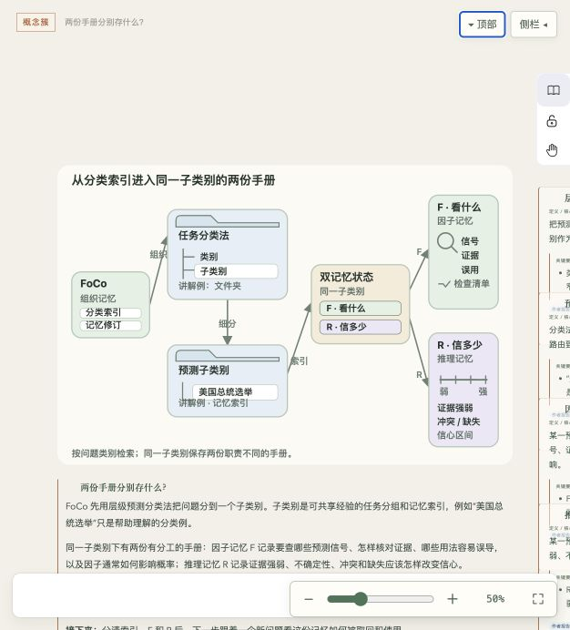

# Loomgraph

**Weave thought into action. · 将思考织成行动。**

Loomgraph 是一张可以和 Agent 一起维护的空间笔记。把知识、流程、文字和图解放在同一个平面上，让复杂内容有结构，让正在推进的工作有迹可循。

用 Codex 或 Claude Code 策划和更新画布，也可以自己编辑、拖动、调整布局，再直接选中需要修改的地方，把意见交给 Agent。



## 用它做什么

- **读懂复杂材料。** 从必要背景到问题、方法和证据，组织连续主线；概念、例子和细节在对应位置展开。
- **看清一项工作如何推进。** 用流程展示阶段、分支和依赖，在节点上查看任务状态与执行记录。
- **梳理系统与方案。** 用思维导图展开组成与关系，穿插说明文字、图片和局部机制图解。
- **和 Agent 一起修改。** 对多个位置分别提意见，一次交接，逐条查看回复和修改结果。

思维导图与流程图可以共存。大问题拆成小分组，每组保留自己的解释和关系；文字与插图直接参与画布编排。

## 画布上的能力

| 能力 | 使用方式 |
| --- | --- |
| 图文混排 | 在同一画布上摆放节点、富文本、图片和自由图形 |
| 多层结构 | 用分组、结构展开与子图组织复杂内容，按需查看细节 |
| 直接编辑 | 修改文字，拖动、调整大小，配合局部自动排版；可固定需要保留的位置 |
| 选区协作 | 单选、多选或框选区域，让 Agent 根据明确的目标处理意见 |
| 增量更新 | 修改受影响的内容，保留其余对象和已有编排 |
| 进度呈现 | 查看运行记录；有新鲜、已验证的执行回执时显示运行脉动 |
| 历史与迁移 | 比较版本、恢复历史，以及导出和导入项目包 |

## 开始使用

需要 **Node.js 24 或更新版本、pnpm，以及支持本地 stdio MCP 的 Agent 客户端**。目前从源码安装。

### 1. 下载并构建

```sh
git clone https://github.com/isagoakira/loomgraph.git
cd loomgraph
pnpm install --frozen-lockfile
pnpm run build
```

### 2. 连接 Codex 或 Claude Code

在 Loomgraph 目录中运行：

```sh
node scripts/configure-client.mjs "../loomgraph-data" ".runtime/client-config"
```

这会生成适合本机的配置，画布数据保存在独立的 `loomgraph-data` 目录中。

- **Codex：** 将 `.runtime/client-config/codex-mcp.toml` 中的配置块合并到 `~/.codex/config.toml`。
- **Claude Code：** 将 `.runtime/client-config/claude-mcp.json` 中的 `mcpServers` 配置合并到工作目录的 `.mcp.json`。

保留已有配置，然后重启客户端或重新加载 MCP 服务。Windows 的 Codex 配置位于用户目录下的 `.codex/config.toml`；生成器会自动使用本机的 Node 路径。

服务在客户端中显示为 `agent_visual_canvas`。这是沿用的接口名称，产品名称为 Loomgraph。

### 3. 创建第一张图

在 Loomgraph 目录中开始 Agent 会话，可以这样说：

> 请先阅读 `skills/agent-visual-canvas/SKILL.md`，然后使用 Loomgraph 把这份材料整理成一张可阅读的图文笔记：先交代背景，再展开核心问题、方法和证据。按小分组组织，必要概念配局部图解，细节在对应位置展开。完成后给我画布入口。

也可以把目标换成任务推进：

> 用 Loomgraph 展示这项任务的阶段、分支和依赖。随着工作推进更新对应节点；实际运行状态根据执行回执呈现。

Loomgraph 会在本机提供浏览器画布入口。它复用当前 Agent 会话，不需要再启动一个模型服务。

### 只想先打开画布

构建完成后运行：

```sh
node scripts/start-canvas.mjs --http-only --data-root "../loomgraph-data" --port 4317
```

打开终端显示的页面入口即可。同一个数据目录同时只运行一个写服务；连接 Agent 时先停止这个预览服务。

## 怎样在图上提出修改

1. 选中一个节点、一条关系，或框选一片区域。
2. 点击 **「让 Agent 处理」**，写下要求。
3. 选择 **「存为独立意见」**，继续标记其他位置；准备好后选择 **「交接并复制」**。
4. 把复制的交接引用粘贴到现有 Agent 会话，让 Agent 处理这一批意见。
5. 通过 **「查看意见与回执」** 查看每条意见的回复和结果。

例如，可以分别要求“补充这个概念的例子”“重新排布这组节点”和“解释这条关系”。每条意见保留自己的目标与回复，不必把不同位置的要求挤进一段长消息。

## 保存与备份

画布内容保存在指定数据目录中。通过界面导出项目包，可用于备份或迁移；导入时建立独立副本。

查看历史、比较版本或恢复到之前的内容，可以从历史面板进入。恢复会产生一个新版本，已有历史仍然保留。

Loomgraph 本身在本机保存项目；Agent 收到的内容仍遵循所用客户端与模型服务的配置。

## 当前版本

Loomgraph 处于早期版本，macOS 已完成本机验证，Windows 的完整使用流程仍待验证。

- 图上请求目前通过复制引用交接到 Agent 会话，尚不支持自动唤起 Agent。
- 运行动效需要实际执行记录；连接中断或回执过期时停止。单纯标记“进行中”不会产生运行脉动。
- 模型服务由所连接的客户端提供，模型调用费用沿用该客户端的配置。

需要了解更多，可查看[交互与客户端兼容说明](docs/HOST_COMPATIBILITY.md)、[数据与项目模型](CONTEXT.md)或[Agent 作图工作流](docs/EXPRESSION_AGENT_WORKFLOW.md)。
