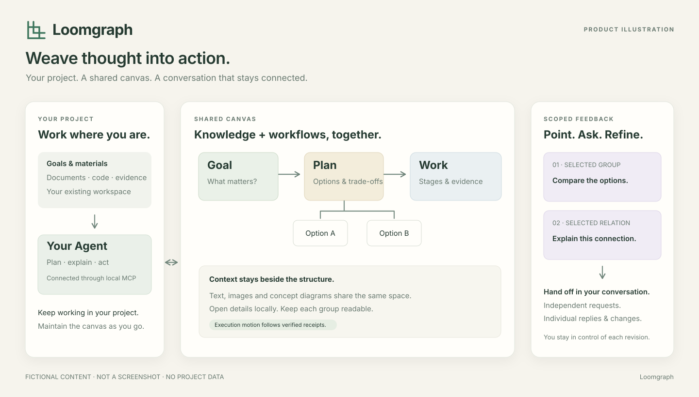

# Loomgraph

**Weave thought into action. · 将思考织成行动。**

Loomgraph 是一张可以和 Agent 一起维护的空间笔记。把知识、流程、文字和图解放在同一个平面上，让复杂内容有结构，让正在推进的工作有迹可循。

连接支持本地 stdio MCP 的 Agent，策划和更新画布；你也可以自己编辑、拖动、调整布局，再直接选中需要修改的地方，把意见交给 Agent。




## 用它做什么

- **读懂复杂材料。** 从必要背景到问题、方法和证据，组织连续主线；概念、例子和细节在对应位置展开。
- **看清一项工作如何推进。** 用流程展示阶段、分支和依赖，在节点上查看任务状态与执行记录。
- **梳理系统与方案。** 用思维导图展开组成与关系，穿插说明文字、图片和局部机制图解。
- **和 Agent 一起修改。** 对多个位置分别提意见，一次交接，逐条查看回复和修改结果。

思维导图与流程图可以共存。大问题拆成小分组，每组保留自己的解释和关系；文字与插图直接参与画布编排。

## 画布上的能力

| 能力 | 使用方式 |
| --- | --- |
| 图文混排 | 在同一画布上摆放节点、富文本、图片和自由图形 |
| 多层结构 | 用分组、结构展开与子图组织复杂内容，按需查看细节 |
| 直接编辑 | 修改文字，拖动、调整大小，配合局部自动排版；可固定需要保留的位置 |
| 选区协作 | 单选、多选或框选区域，让 Agent 根据明确的目标处理意见 |
| 增量更新 | 修改受影响的内容，保留其余对象和已有编排 |
| 进度呈现 | 查看运行记录；有新鲜、已验证的执行回执时显示运行脉动 |
| 历史与迁移 | 比较版本、恢复历史，以及导出和导入项目包 |

## 开始使用

需要 **Node.js 24 或更新版本、pnpm，以及支持本地 stdio MCP 的 Agent 客户端**。目前从源码安装。

### 1. 下载并构建

```sh
git clone https://github.com/isagoakira/loomgraph.git
cd loomgraph
pnpm install --frozen-lockfile
pnpm run build
```

### 2. 接入你正在使用的 Agent

在客户端添加一个 **本地 stdio MCP 服务**，指定 Node 可执行文件、Loomgraph 启动脚本，以及本项目的画布数据目录。支持常见 `mcpServers` 配置格式的客户端可以参考：

```json
{
  "mcpServers": {
    "loomgraph": {
      "command": "/absolute/path/to/node",
      "args": [
        "/absolute/path/to/loomgraph/scripts/start-canvas.mjs",
        "--data-root",
        "/absolute/path/to/your-project-canvas-data",
        "--port",
        "0"
      ]
    }
  }
}
```

将三个路径替换为本机的绝对路径。Windows 使用对应的本机路径；JSON 中的反斜杠需要写成 `\\`。如果客户端使用其他配置格式，按其本地 MCP 设置填写同样的可执行文件和参数即可。

为不同项目选择独立的数据目录。客户端支持项目级配置时，把连接配置放在**你实际工作的项目**中；配置完成后重新加载 MCP 服务。

也可以在 Loomgraph 安装目录运行下面的命令，生成带有本机 Node 和启动脚本路径的 JSON / TOML 配置，供合并到客户端设置：

```sh
node scripts/configure-client.mjs "/absolute/path/to/your-project-canvas-data" ".runtime/client-config"
```

为了让 Agent 按合适的粒度组织和维护画布，建议将安装目录中的 `skills/agent-visual-canvas/SKILL.md` 加入客户端的技能或项目指引。客户端不支持技能安装时，在首次使用中让 Agent 读取该文件的绝对路径即可。

### 3. 在你的项目中启用画布协作

打开**你正在研究、开发或推进的项目**，在原有 Agent 会话中发出指令：

> 在当前项目中使用 Loomgraph，作为我们组织工作和后续交流的共享画布。先读取 Loomgraph 的作图指引，再打开本项目的画布，围绕当前目标梳理必要背景、关键问题、方案、任务阶段与依赖。按易读的小分组组织，结合思维导图、流程、文字和图解。给我画布入口；后续随项目推进局部更新，保留我的手工编排，并逐条处理我在图上提出的意见。

如果没有安装作图技能，将 `SKILL.md` 的本机绝对路径附在这条指令中。Agent 继续在当前项目里分析材料和执行任务，Loomgraph 承载双方共同查看的结构、进展和反馈。

后续可以直接在原会话中说：

> 把刚讨论的方案补到画布中，更新对应阶段的状态，并保留其余分组。

或者在画布中选区、写意见，再将反馈交接到同一个会话。聊天与画布形成持续的协作过程；运行状态按实际执行回执更新。

Loomgraph 在本机提供浏览器画布入口，复用你正在使用的 Agent，不另开模型服务。

### 只想先打开画布

构建完成后运行：

```sh
node scripts/start-canvas.mjs --http-only --data-root "../loomgraph-data" --port 4317
```

打开终端显示的页面入口即可。同一个数据目录同时只运行一个写服务；连接 Agent 时先停止这个预览服务。

## 怎样在图上提出修改

1. 选中一个节点、一条关系，或框选一片区域。
2. 点击 **「让 Agent 处理」**，写下要求。
3. 选择 **「存为独立意见」**，继续标记其他位置；准备好后选择 **「交接并复制」**。
4. 把复制的交接引用粘贴到现有 Agent 会话，让 Agent 处理这一批意见。
5. 通过 **「查看意见与回执」** 查看每条意见的回复和结果。

例如，可以分别要求“补充这个概念的例子”“重新排布这组节点”和“解释这条关系”。每条意见保留自己的目标与回复，不必把不同位置的要求挤进一段长消息。

## 保存与备份

画布内容保存在指定数据目录中。通过界面导出项目包，可用于备份或迁移；导入时建立独立副本。

查看历史、比较版本或恢复到之前的内容，可以从历史面板进入。恢复会产生一个新版本，已有历史仍然保留。

Loomgraph 本身在本机保存项目；Agent 收到的内容仍遵循所用客户端与模型服务的配置。

## 当前版本

Loomgraph 处于早期版本，macOS 已完成本机验证，Windows 的完整使用流程仍待验证。

- 图上请求目前通过复制引用交接到 Agent 会话，尚不支持自动唤起 Agent。
- 运行动效需要实际执行记录；连接中断或回执过期时停止。单纯标记“进行中”不会产生运行脉动。
- 模型服务由所连接的客户端提供，模型调用费用沿用该客户端的配置。

需要了解更多，可查看[交互与客户端兼容说明](docs/HOST_COMPATIBILITY.md)、[数据与项目模型](CONTEXT.md)或[Agent 作图工作流](docs/EXPRESSION_AGENT_WORKFLOW.md)。
