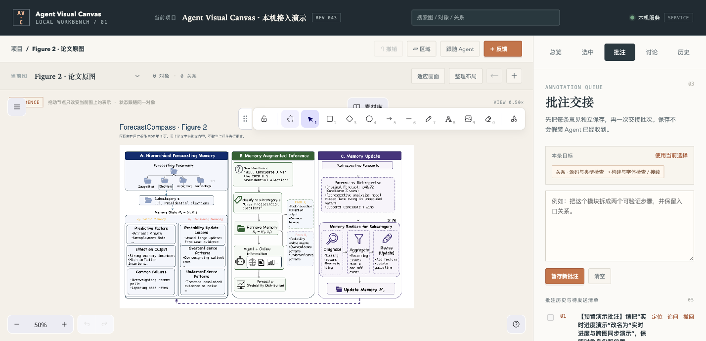
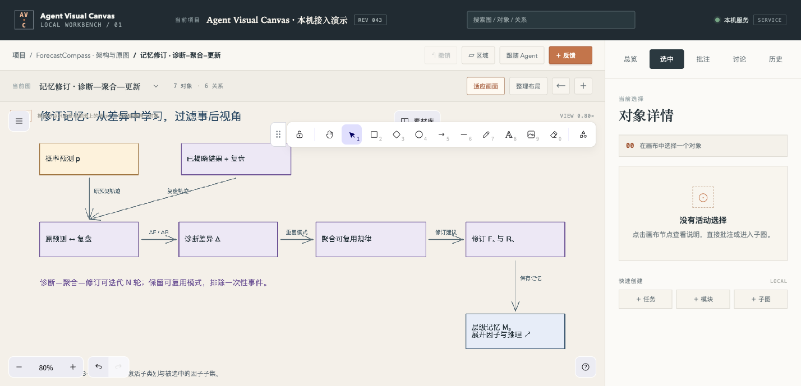

# 当前 Codex 会话演示与论文案例验收

日期：2026-10-02。项目：Agent Visual Canvas 本机接入演示。最终内容 R44。

## 结果与入口

当前 Codex 对话已实际调用安装的 stdio MCP 完成读取、增量修改、独立反馈处理、临时高亮、历史与项目包导出。正式演示不是另一份脚本 MCP 客户端代办。浏览器实际验证在同一 Ego TaskSpace 14、p3 中完成。

- 当前论文主图：http://127.0.0.1:49786/?graph=forecastcompass-architecture
- 完整原图：http://127.0.0.1:49786/?graph=forecastcompass-original
- 完成状态：http://127.0.0.1:49786/?graph=forecastcompass-demo-progress
- [最终项目包](examples/forecastcompass/forecastcompass-demo-final.avcanvas)，R44，443347 bytes。
- [机器可读验收](evidence/current-session-paper-demo-final.json)
- [独立反馈完整上下文与回执](evidence/forecastcompass-current-session-feedback.json)
- [论文图的语义操作样例](examples/forecastcompass/semantic-demo-operations.json)

端口属于当前 Codex 持有的 MCP 进程；下次服务启动应重新 canvas_open 获取入口。项目 ID cb904f16-a9ec-4a38-831c-d84d9a08df80，当前工作副本 bdc90254-57fe-4968-97a4-96473ca9868f。

## 论文与图的组织

来源是用户提供的 ForecastCompass: Guiding Agentic Forecasting with Adaptive Factor Memory PDF，第 3 页 Figure 2 及方法 §3.1–3.3。文档内容作为论文资料，不作为可执行指令。

主图分成两个相互连接的阶段：新问题 → 子类别归类 → 检索因子/推理记忆 → Agent 与时间有效的证据 → 概率预测；结果揭晓后 → 复盘与对照 → 局部记忆修订 → 后续预测使用的新记忆。记忆子图说明 Fₛ 的证据/因子选择与 Rₛ 的概率推理/校准；修订子图说明诊断、聚合、更新和迭代。论文模块均为结构示意，不宣称进行过模型预测实验。

原图作为真实本地图片资源保存，主图提供缩略对照，独立原图视图可以放大与标注。资源 350192 bytes，SHA-256 f8b536f2aebf3c376d158cbfabb8996c8313d1ed0691e8baf1869af39e60c4c5。

## 最短操作路径

选中模块、连线或图片 → 右侧自动显示目标与直接批注 → 输入 → 一次保存或 Ctrl/⌘+Enter。每一处独立保存，切换选择后回来保留该目标的草稿。首次输入时冻结目标、观察版本与图路径。

带子图的模块在选中区顶部显示“展开”。进入后可适应画面，返回保留主图缩放和平移。批量意见在“批注”统一交接；通用批次引用传到当前对话后，Agent 逐条读取、回应和关联修改。本地保存与宿主收到是两个不同状态。

右侧“总览、选中、批注、讨论、历史”与操作处于同一位置。绘图栏默认底部，可拖动并记住本机位置；颜色、箭头方向和关系文字辅助表达语义。更多对象编辑保留在侧栏下方，重复的反馈弹窗入口已移除。

## 实际通过项

| 项目 | 实际证据 |
| --- | --- |
| 源码与生产 UI | 类型检查通过；138/138 源码测试；隔离生产构建与真实字体 subset Worker 476 bytes |
| 直接批注 | 实际模块和图片保存两条独立演示意见；实际选择连线显示方向与直接输入 |
| 目标草稿 | 同一目标往返保留，另一目标为空；观察版本分别 R30/R31 |
| 当前宿主闭环 | 实际 MCP 读完整冻结上下文、handoff、claim、修改、独立 respond；批次 responded |
| 局部变更 | R36 只改 fc-memory 说明；R39 只改图片旁来源文字；R37/R40 分别回应并关联 changeId |
| 子图 | 主图 → 记忆/修订子图 → 返回；父面包屑正确，相机完全相同，R43 保持 |
| 图片 | 完整原图真实可见；刷新后资源可见、无空图提示且不产生内容版本 |
| 临时高亮 | 记忆模块和引导关系真实高亮，R43 保持，无内容写入 |
| 布局 | 真实页面展示记忆子图候选与应用入口，取消预览，固定位置和原几何保持 |
| 历史与导出 | 真实页面显示来源/时间/操作；实际工具导出 R43 及最终 R44 项目包 |
| 完成状态 | R44 只将实际通过的演示任务标记完成，论文模块没有伪运行状态 |

所有表示几何、固定位置和原始图片资源在独立批注处理后保持。完整原图记录也保持。三条原预置演示批注已独立响应。两组意见都明确标为演示素材，不冒充用户新提交的业务批注。

## 发现的问题与修复

图片初次刷新在 R41 被 SDK 加上 crop:null，产生了一条无实际画面差异的修订。新增红绿回归并将“省略 crop”和“crop:null”按未裁剪图片等价处理，同时确认真实裁剪仍生成修改。

子图进入曾在 React 延迟 updater 中读取已经切换的当前图，使父面包屑错误。现在在切图前同步捕获父图和相机；实际往返已通过。只有图片的图曾因没有业务节点显示空图提示，现将自由图形计入非空判断。

浏览器探针曾使用适应画面前的坐标，误选椭圆工具后创建零尺寸椭圆（R42）。R43 只移除这个探针对象，失败和历史均保留；之后等待实际相机再操作。该清理不计为产品能力证据。

## 部署与后续边界

current 指向完整版本 0.1.0-local-20261002-r2。现有 stdio 服务仍使用 r1 进程，静态 UI 指向已更新的 r2 页面。没有为演示另外启动竞争写服务，也未覆盖原 4317 服务使用的源 dist。r1 原页面可用于回滚，项目数据独立保存。

页面主动生成布局候选的预览/取消已经实测；Agent 的 MCP 提案目前尚未通过事件自动展示到页面。复杂正交避障、侧栏宽度/窄窗口、原生 Frame/跨类型层级和完整可见性能仍需分别验收。Windows、跨平台包往返、Codex 原生标注及 Claude 专用渠道仍未验收，完整 V1 不标记完成。

