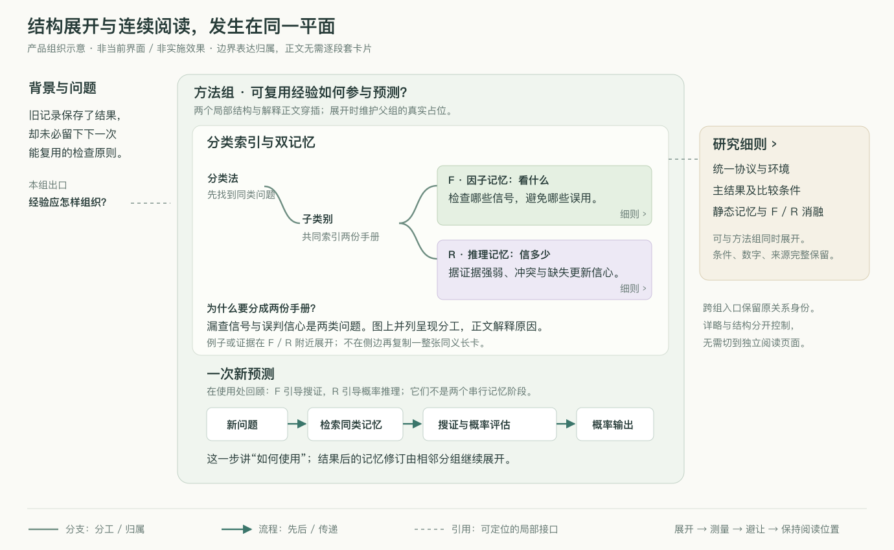

# 空间笔记与任务图谱：细化规则及现有实现改造方案

日期：2026-10-04。状态：**已获实施授权，正在并行改造与隔离页面验收。方案规则仍为权威规格，实际通过项以验收记录为准。**

依据：[产品逻辑复审](research/PRODUCT_LOGIC_REVIEW_2026-10-04.md)、[当前结构诊断](research/CURRENT_STRUCTURE_DIAGNOSIS_2026-10-04.md)、[固定 V1 计划](plans/excalidraw_plugin_v1_implementation_plan.md)、[需求审计](plans/excalidraw_plugin_requirements_audit.md)及 [领域语言](../CONTEXT.md)。本文是这次改造的权威入口，不覆盖原 V1 尚未通过的平台与宿主验收门槛。

## 1. 改造目标与明确取舍

目标是让同一二维平面成为可读、可编辑、可持续维护的笔记与任务工作区：**分组有分工，组内有条理，展开有空间，关系有语义，增量不打断阅读。**

用户已经确认：图文在同一平面穿插；思维导图与流程图共存；小团簇与多级展开；默认就地阅读；多个位置独立批注；自由编辑与可恢复变更；轻量本地 stdio MCP。D018 已确认“默认持续维护局部排版”，无需再次询问是否默认自动排版。

本轮按以下细则设计：

1. **组织分组承担层级。** 它回答一个问题或表达一项交付。边框只是显示手段，不是分组本身。
2. **展开下一层结构与展开解释分别操作。** 聚焦是镜头操作；缩放只改变观看尺度。首个改造版本不根据缩放阈值自动收起用户展开的内容。
3. **布局依据当前实际显示的占位。** 正文可以增长，也可以收缩；父组包含实际子内容，邻居按父组整体边界避让。
4. **自由编辑保留确定的控制方式。** 点击激活，显式拖动手柄移动，原位编辑；悬停不取得操作权。
5. **持续维护的范围可解释。** 先组内编排，再按原顺序推开碰撞的同层邻居；更换分工、顺序、方向或其他组内部布局时提供候选预览。
6. **Harness 与显示层使用同一份组织及显示事实。** Agent 先划分表达责任，再生成内容，最后核对实际可见结果。

保留 Excalidraw 0.18.1、ELK.js 0.12.0、现有项目身份与事务存储。此次不以更换画布引擎解决产品逻辑问题，也不新增常驻模型服务。

## 2. 用户应理解的组织模型

### 2.1 三种组织各自负责什么

| 组织 | 含义 | 查看或操作方式 | 不应影响的身份 |
| --- | --- | --- | --- |
| 组织分组 | 一张图内的主题、阶段或局部交付；可以继续嵌套 | 在原平面展开、收起、整体移动或局部整理 | 不改业务对象父项，不创建另一张图 |
| 子图 | 一张独立的图，通过入口引用 | 明确的“进入子图”动作及路径返回 | 同一子图可有多个入口；不绑死唯一父图 |
| Excalidraw 原生 group / Frame | 用户在图内建立的几何组织 | 组合变换、原生绘图、Frame 操作 | 不自动推断任务父子、知识层级或执行关系 |

组织分组的父子层级描述**表达归属**。知识联系和执行流程仍由原始 Relation 表达，可以交叉、并列或反馈。不能为了一棵整齐的树删除必要关系。

一个业务对象可有多个图上表示。对同一个图上表示，排版只允许一个负责位置的组织分组；其他地方通过引用或该对象的另一个真实表示复用。不能让两个布局过程同时为同一个表示决定坐标。

代码字段继续采用已有 `clusterId/clusterIds` 指组织分组；`Representation.canvas.groupIds` 只指 Excalidraw 原生组合。以下“组”是产品用语，不新增一套含义相同但身份不一致的 group 命名。

### 2.2 分组默认显示什么

折叠态保留：标题、一个问题/结论或状态、下级结构的简短概况、必要对外接口。理解分组说明“本组回答什么”；任务分组说明“做到哪里、何处受阻”。无内容的装饰字段不占一行。

展开态保留同一组标题，并显示下一层内容。正文、图解、对象表示与下级分组可以穿插；不要求每个分组都套一个巨大的矩形容器。

边界按用途选择：

- 简单概念分支：标题、留白和分支线即可。
- 密集条目、比较表、任务阶段：轻边框或浅底区分归属。
- 选中或整理时：显示可操作的完整边界。

边界样式不会改变碰撞规则。无边框内容仍然有真实占位。

### 2.3 局部组织由任务决定

| 要表达的结构 | 编排规则 | 阅读责任 |
| --- | --- | --- |
| 思维分支 | 中心问题及有名称的分支；分支内部继续归纳 | 解释分工、包含、对照和必要概念 |
| 执行/方法流程 | 明确入口、步骤、出口；反馈有单独路由 | 解释先后、数据传递和状态 |
| 对照 | 同口径栏目与对齐的条件、结果 | 解释差异及其成立条件 |
| 连续文字 | 稳定栏宽、自然高度、段落与图解相邻 | 解释原因、例子与承接 |
| 自由构图 | 手工位置优先；新增与展开避让现有构图 | 保留用户的空间表达 |

这些是内部排版策略和 Agent 的组织建议，不增加五个互斥的产品页面。一个父组内可用流程组织阶段，在某阶段里用思维分支解释概念，再插入一段正文。

## 3. 具体交互规则

### 3.1 默认、展开、收起、聚焦与返回

| 动作 | 实际结果 | 应保留的内容 |
| --- | --- | --- |
| 首次打开已有项目 | 保留原构图；无新组织信息时按兼容策略显示 | 原位置、图上表示、自由文字与图片 |
| 首次打开已组织的新图 | 显示上层分工及默认工作组的一层结构；宽度不足时沿阅读方向延展 | 必要背景与入口，而非全量缩小 |
| 再次打开 | 恢复该工作副本的镜头及展开偏好；失效引用安全忽略 | 已保存内容及可继续定位的位置 |
| 点击分组的“展开结构” | 同平面显示它的下一层子结构，局部排版让位 | 父组标题、结论/状态及对外接口 |
| 点击对象的“解释/细则” | 在该表示附近展开对应内容 | 标题、核心结论及相关图解 |
| 展开第二个分组 | 保持第一个分组展开；二者参与共同避让 | 并行阅读与独立批注 |
| 收起分组 | 子内容暂时不渲染，保留分组摘要；记住子内容原展开偏好 | 对象与关系身份、批注、子图入口 |
| 再次展开 | 恢复记住的子内容偏好，依据当前版本重新测量 | 不恢复已删除内容或旧的过时几何 |
| 聚焦分组/对象 | 镜头移动到可读位置，不过滤其他区域，不自动关闭它们 | 当前展开选择与返回记录 |
| 返回 | 恢复上一镜头和阅读锚点；若内容变化，沿稳定身份重新定位 | 不用历史像素覆盖新的内容布局 |
| 拉远/缩放滑块 | 改变镜头尺度，明确显示缩放值 | 首期不隐式改变结构和正文展开 |

“回到上层”聚焦父组；“收起”才收起结构。项目骨架可通过明确的“收起到上层”动作查看，保留返回前展开状态。停止沿用当前 `scope=overview/cluster/all` 三种模式按钮来承担所有行为；旧偏好仅作为迁移输入。

浏览展开是查看状态，保存在本机视图偏好中，不进入项目内容修订。明确新增分组、改归属、拖动、调整尺寸或应用整理才进入事务历史。

### 3.2 点击、拖动、滚轮与编辑

| 位置或状态 | 输入 | 结果 |
| --- | --- | --- |
| 未激活的内容块 | 单击 | 激活并选中，显示附近少量操作；不弹窗、不自动展开 |
| 未激活的内容块或空白 | 普通按住拖动 | 平移画布；移动阈值以内才作为点击 |
| 激活的文字 | 拖选 | 选择文字，可直接生成独立批注 |
| 内容块的移动手柄/已激活标题拖动区 | 拖动 | 移动该块；释放后事务保存并保持手工固定 |
| 横向调整手柄 | 拖动 | 调宽并保持当前高度策略；正文真实换行重新参加布局 |
| 纵向调整手柄 | 拖动 | 明确设定固定高度预览，标示可滚动；可用“恢复自然高度”还原 |
| 编辑按钮或正文双击 | 操作 | 原位编辑；退出后提交一次可追踪的内容变更 |
| 正在输入 | 按键 | 编辑器拥有输入；Delete/Backspace 不删除模块 |
| 任意区域 | 空格拖动/中键拖动 | 始终平移画布；不被卡片或连线截获 |
| 自然高度正文 | 滚轮 | 平移画布，不制造内部滚动区 |
| 用户固定高度的预览正文 | 无拖动时滚轮 | 不必先激活即可滚动正文；到边界仍由正文消费，避免画布突然移动 |
| 固定高度正文 | 缩放组合键/正在平移 | 交给镜头操作，不转为正文滚动 |

一次拖动从开始到结束由同一对象拥有。不能因为指针经过卡片、线的点击区或编辑器而改变拥有者。连线只在选中工具下接受自身窄路径点击，不遮盖正文和拖动手柄。

固定预览内滚轮专心阅读，不在末尾突然平移画布；需要移动画布时使用空格/中键或把指针移到空白。激活后的正文拖选与未激活内容上的拖图使用相同的明确手势拥有者规则，不依赖悬停切换。

正文默认完整自然高度。用户主动选择固定高度预览后才出现内部滚动；“展开全文”恢复自然高度并触发局部避让。改宽度不暗中截断正文；自然高度的纵向尺寸不作为隐藏文字的手段。

编辑草稿即时显示、即时测量。草稿布局不产生修订；确认提交后显示存储回执。退出、收起或导航前完成正常提交；发生冲突/失败时保留草稿和原区域，不能丢弃输入后静默收起。

中文输入法组合期间保持编辑器位置、宽度和镜头，测量结果标为临时；组合结束后以新 epoch 合并维护，不能让迟到结果挪动输入位置或形成额外几何修订。

### 3.3 最少操作入口

分组附近保留“展开结构/收起”和“聚焦”；对象附近保留“解释/收起、编辑、批注”，更多操作收进菜单。移动、变形、删除只在选中或编辑时出现。单个按钮直接执行其动作，不要求先确认选中再确认一次。

顶部保留项目/图路径和当前任务重点；排版策略放在局部整理或组属性中。保留已实现的顶部、右栏独立尺寸调整和隐藏功能；缩放滑块留在右下角并计入可用视口，工具区不得盖住当前正文。

### 3.4 删除的范围与撤销

选中的表示或自由文本/图片可直接删除并撤销；键盘正在编辑文字时只编辑文字。删除一个表示只移除它在当前图的呈现，不删除共享业务对象、其他表示或其业务关系。组织引用的清理与删除在同一事务完成，历史批注的原目标仍可解释。

删除恰好作为组 anchor 的表示时，不按标题或“第一个剩余成员”猜新入口。保留 cluster 身份、标题和其余成员，标记入口待修复；用户可在原组指定替代 anchor。没有替代时该组仍可浏览，Harness 明确报告缺口，不能静默删组或把它视为完整结构。

分组菜单默认提供“解散分组”：成员和下级分组归到原父组，根级则保留在同一画布的未分组区域；内容不丢失。删除共享业务对象作为单独明确的操作处理，不混在“解散分组”里。locked 内容须先解除编辑限制；pinned 不阻止用户主动删除，只约束自动布局。

解散事务同时更新直接成员、parentId/order、位置 owner 与 organization.links；指向被解散组的组织 link 移除并留在变更记录，原业务 Relation 保留，不自动猜新的语义端点。撤销/恢复按同一事务恢复组织、成员、owner、links 与相关几何；并发冲突使关联结构无法一起恢复时拒绝该候选并列出冲突，不能留下半恢复层级。

### 3.5 自由调整结构

拖动分组手柄时整体移动该组负责位置的成员与下级结构，保留内部相对关系；其他组的引用不随之移动。用户明确移动整个分组可移动其 pinned 成员，移动后继续保持固定；locked 或无法完整包含的原生组合造成冲突时禁止部分提交。

调宽分组改变其内部可用编排宽度并实时预览换行与局部安排，不直接拉伸字形。释放后一次事务保存明确的手工修改；撤销恢复本次影响。手动调宽仍受固定位置约束，不能为了适配容器偷偷移动未授权的固定成员。

将节点或子组改归属用明确的“移入/移出分组”动作；单纯拖到某个框里不自动改知识归属、任务父项或执行关系。这样自由空间构图与有意义的结构编辑各自可预测。

## 4. 内容详略与有限阅读记忆

默认可见层不是模板字段的合集，而是**足够回答当前局部问题的信息**。

| 内容 | 默认责任 | 展开后责任 |
| --- | --- | --- |
| 标题 | 说明问题或职责 | 保持作为定位锚点 |
| 一句核心判断 | 让读者知道应带走什么 | 不在要点和正文开头逐字复制 |
| 局部图解/结构 | 展示分工、分支、步骤、输入输出 | 在原位置接出机制细节或例子 |
| 解释正文 | 说明因果、例子、前后承接 | 完整显示必要段落 |
| 研究细则 | 默认显示用途/关键发现 | 参数、环境、定量结果、消融、来源和未确认项 |
| 任务状态 | 状态、阻碍、来源及时间 | 运行回执、日志和下一项交付 |

停止从正文前三节自动抽出“关键要点”并与完整正文同时展示。旧内容保留在源数据中，显示层先消除重复投影；删除或改写原文属于单独内容修改。

原子化标准是能独立引用、复用、判断或改变：一个概念及其必要短解释保持在一起；一个步骤要有输入/动作/输出；一条研究证据要有条件/量/结论。纯名词不自动变成节点。

每组明确 `requires / introduces / recap / handoff` 的表达责任：

- 首次使用概念时给必要定义或图例，不能默认读者懂缩写。
- 复用概念时，在当前使用处给短回顾并链接共同身份；不能只给跨屏长线。
- 判断回顾需求依据实际阅读路径和当前显示内容；不假定空间距离等于阅读时间。
- 分组出口说明下一组为什么需要这项结论。研究细则与主干使用同一符号口径。
- 图例和正文互补；图例内的可引用部件保留 `figureId + partId`，示意例与论文原图分别标注。

上述字段可先放版本化表达 metadata，不增加每个卡片必须展示的标签栏。检查可以发现术语缺口、逐字重复和来源缺失；能否被初次接触者理解仍要通过读者任务验证。

## 5. 排版维护的确定规则

### 5.1 一份几何事实供所有显示层使用

改造后以同一个投影结果供 HTML 内容、SVG 连线、组织边界、选择、批注定位、缩略预览与镜头定位使用。不得各自从 source 位置、临时布局或旧测量中另算一套端点。

流水线为：

`内容及组织 → 当前展开/详略 → 宽度与显示约束 → 实际测量 → 组内编排 → 父组占位 → 同层避让 → 路由 → 验证 → 一次显示更新`

| 占位 | 应包含的内容 |
| --- | --- |
| 内容块 | border-box、自然正文高度或预览窗口高度、标题、可见内控件 |
| 旋转块 | 旋转后几何的保守轴对齐包围盒；必要时再优化间距 |
| 分组 | 标题/摘要区、当前子内容、内距；下级展开逐层向父组汇总 |
| 关系标签 | 文字及可见底衬；不允许标签盖住正文 |
| 固定障碍 | pinned、locked、原生组合及 Frame 中不能拆开的内容 |
| 界面工具 | 当前可用视口的扣除区，不混为项目内容节点 |

子内容位于父组内部不是碰撞；同层块覆盖、子内容盖住父组标题和非意图正文覆盖才是失败。用户有意的图片叠放另行显式允许，不可由 solver 猜测。

### 5.2 测量既能增长，也能收缩

自然高度以当前内容测量为准；source 高度是首次估计，不永远取 `max(source, measured)`。只有用户明确设置的最小高度才作为下限。固定预览测量其窗口高度，正文 `scrollHeight` 不应把预览误扩成全文。

测量使用未乘镜头缩放的局部坐标。字体、字号、行距、宽度、内容、详略、旋转和资源加载情况都影响结果；图片/字体完成加载后重测。概念图解可保留比例，正文可单独换行。

测量缓存带内容与显示版本键；不能复用上次全文展开的高度来排当前摘要。删除、换图或收起后移除失效记录。异步回调带 graph、工作副本、source revision、view epoch 和 geometry key；不属于当前状态的结果丢弃。

布局可能改变宽度，宽度又改变换行，因此协调过程最多做有限次“宽度→测量→布局”收敛；首轮以三轮为上限验证。仍不稳定时保留最近可读结果和诊断，停止来回抖动；不把未收敛尺寸写入源数据。

### 5.3 自动维护的范围与顺序

1. 定位发生变化的内容及其负责位置的分组。
2. 保留该组既有方向、同级次序、手工位置与关系端口，优先只处理变化处。
3. 汇总真实父组边界；对碰撞的同层邻居进行尽量小的平移，不重排其内部。
4. 必要时向父层继续维护边界与同层避让。
5. 不发生碰撞的分组不移动；状态标识变化不触发布局，除非真实尺寸变了。

“跨组大调整”明确指：改变同层顺序/方向、改变成员归属、重新编排另一个组内部或搬动固定内容。它形成可预览候选，不由一次展开自动应用。普通邻组平移仍需报告影响范围；超出局部位移预算时转为候选预览，预算由实际视口验收校准。

ELK 可提供流程与复合层级候选。稳定增量、固定约束、正文流式化和最终验证由应用层承担；不承诺 ELK 自带 yFiles `fromSketchMode` 式稳定性。

P1 的自动局部维护采用确定性应用层规则；ELK 留在显式整理候选路径。先证明简单局部闭环稳定，再评估是否需要 ELK 参与更多局部策略。

### 5.4 固定内容、组合与无解情况

`pinned` 固定位置，`locked` 限制编辑/变换，固定预览高度约束显示窗口；三者不能混用。固定位置仍可显示更多内容，并把增长后的边界作为障碍参加排版。

原生组合整体处理。若组织分组切开一个原生组合，或 Frame/locked/pinned 的约束不能同时满足，禁止部分移动和暗中取消约束。先尝试同组近侧空白位置及保持原结构的避让候选。

仍无可读局部解时保留当前无碰撞画面，在展开入口说明具体固定障碍，并提供“预览调整/在旁侧展开/允许自动布局”等有实际可行结果的动作。不能已宣称展开完成却隐藏新内容，也不能任意把细则放到远处并画一条超长线。

### 5.5 阅读位置与收起恢复

阅读锚点包含稳定 ref、可用的 section/paragraph 位置及其屏幕位置。展开优先保持点击位置或当前段落；编辑优先保持光标；纯状态刷新不改变镜头。

一次布局完成后再补偿镜头，不分别对各块滚动。正常约束下首轮验收目标为锚点残余位移 ≤8 CSS px；这是待测工程目标，不是已经实现的承诺。目标被删或收起时退到其父组标题，并说明原因。

收起恢复依据展开前的局部安排；如果期间无新内容、拖动、固定或其他展开，邻居应回到原位置。若状态已改变，按当前约束维护，不强行写回旧快照。多个组的展开/收起独立，不能恢复一个组时覆盖另一个组的浏览状态。

### 5.6 查看状态与内容保存

| 行为 | 保存位置 | 是否产生项目修订 |
| --- | --- | --- |
| 镜头、展开、正文详略、预览滚动 | 本机视图偏好/临时投影 | 否 |
| Observer 测量及自动浏览避让 | 当前显示事实及缓存 | 否 |
| 编辑草稿 | 当前编辑状态，失败时可恢复 | 否 |
| 编辑提交、拖动、固定、变形、删除 | 既有事务与变更历史 | 是 |
| 新增/改名/嵌套分组、调整表达责任 | Graph / 内容 metadata 的事务 | 是 |
| 明确应用整理 | 验证过且不过时的几何及组织操作 | 是 |

Agent 提交内容后，浏览器维护临时显示布局；没有浏览器测量时只能返回“数据已保存，显示未验证”。重开可按源位置、组织和偏好重算。保留现有 `projectNotebookView` 将浏览布局与 source 分离的原则。

原生 `onChange` 使用当前投影 token 做逐字段归一化：临时尺寸、位置、隐藏样式、派生边界与自动 route 不回写 source；用户实际文字、变形、分组及排序变化继续保存。陈旧投影回调不得被解释成用户删除隐藏元素或重新布局。

## 6. 连线与跨组接口

所有可见关系由一个 RelationPlan 决定，其几何使用第 5 节同一投影。

- 思维分支：柔和曲线或有间距的折线，通常无箭头；表示归属/解释，保留关系语义。
- 流程：明确方向与入口/出口，避免对角线穿正文；必要的反馈从外侧返回。
- 引用/证据：较弱虚线或短引用，默认不抢主线。
- 同一个局部允许上述样式共存；不能用全局“思维导图/流程图”开关互斥显示。

跨组关系默认聚合为组边界附近的具名接口，按关系类型、端点组及含义汇总，不把相反方向或不同语义混成一个“相关”。每个接口保留原 `relationIds` 和实际端点。点击可定位另一端，返回原镜头；两端同时展开时可显示直接连线。用户显式追踪某条跨组关系时才突出完整路径。

卡片内不再常驻重复列出已经由局部结构表达的全部关系。选中关系后就地显示其解释、传递内容及来源；诊断缺信息时显示具体缺口。

native scene 中隐藏的受管关系仍是持久内容投影基线。改造前必须核对实际显示与交互，不把“隐藏 baseline + SVG”直接当作已证实的重复线。每个显示模式只有一个可见关系提供者，并保证隐藏层不截获输入。

## 7. 理解与监控共用结构

默认主导重点可由图指定，局部组可覆盖；同一画布上理解与监控能共存。切换重点只改变摘要内容、异常显著性和关系优先级，不另建一套物理布局。

| 理解优先 | 监控优先 |
| --- | --- |
| 问题、必要概念、图解和承接 | 当前阶段、实际状态、阻碍与下一项交付 |
| 研究细则就地展开 | 执行回执与日志就地展开 |
| 背景/方法/证据各有责任 | 结构定义/任务状态/运行实例各有来源 |

任务汇总按 taskId 去重。被折叠的子任务失败或阻塞仍传到组摘要；不把失败淹没在平均完成度中。论文流程没有实际运行时明确说明是方法示意。

保留当前 TaskStatus、RunRecord 和 ControlRequest 的区分。请求入队、执行器接收、真实运行及完成分别展示。状态更新时间与执行证据时间分别读取；过期只表示没有新观察，不能自动改为失败或成功。

## 8. 数据契约与兼容策略

### 8.1 最小模型扩展

计划在 `graph.metadata.organization` 的 schemaVersion 1 上增加可选层级及表达字段，保持 ProjectSnapshot schemaVersion 1；既有 clusters/links/ref 语义不删除。新行为按读取器能力识别，具体字段由 root 统一实现并校验。若实施发现必须改变原有引用语义，再单独提升 organization 版本并提供显式迁移；不在本轮先引入格式大迁移。新增能力至少包括：

| 内容 | 要求 |
| --- | --- |
| 组织分组 | 保留 cluster 稳定 id；可选 root、parentId、同级 order、标题、问题/目的、摘要 anchor、直接成员 refs；children 与祖先成员闭包由 parentId 派生 |
| 排版责任 | `layoutOwnerByRef` 以 `representation:id` / `element:id` 为键指向 clusterId；唯一直接归属可推导 owner，多 membership 必须明确唯一 owner；其他组仅呈现引用，不参与该 ref 的坐标计算 |
| 局部形式 | 组内默认形式，必要时下级覆盖；与 Relation.kind 分开 |
| 表达责任 | 必要前提、引入概念、回顾、出口承接及来源 refs |
| 对外接口 | 稳定接口 id、原 relationIds、实际端点和含义 |
| 默认显示 | 首次展开路径/默认详略；用户随后选择另存视图偏好 |

分组本身不是新 Entity，不伪装成任务。其变更使用现有 `graph.patch` 的受控 metadata 更新；必须逐字段校验和冲突检测，不能盲目覆盖整个 graph metadata，丢失 notebook、未知扩展或同期变更。

`members` 只记录本组直接成员，祖先不重复存子组的完整列表；递归成员闭包由 parentId 派生，几何按真实 child bounds 汇总。anchor 及直接成员纳入同一位置责任检查。多 membership 缺 owner 的旧数据属于可读、待整理状态，不自动推断 owner。

“移入”默认转移位置 owner 并移除原直接归属；“添加引用”只增加另一组的引用 membership，保留原 owner；“在此新建表示”显式创建新的 Representation 身份并复用同一 Entity。解散根组后没有位置负责组的 ref 保持未分组，在现有位置完整显示；即使其他组仍有引用，也不据此强行迁走。

### 8.2 分组批注与观察版本

保留 Annotation.targets 的已有稳定对象引用。针对分组的批注需要额外保留稳定 clusterId，避免只记一个几何区域。

方案在 Annotation 增加可选 `organizationAnchors`，保存 graphId、clusterIds、实际选定 refs、观察时祖先路径与 `selectionMode`。Annotation.targets 仍记录该组 anchor 与选定成员的已有 TargetRef；不新增假业务实体，也不把分组身份塞入正文 sectionId。

批注创建时冻结最小组快照，至少含标题、parentId、anchor、当时成员及当时实际可见/选择范围，并关联 Annotation.observedRevision。完整历史可用于深查，最小快照保证无完整历史的项目包仍能解释批注。组改名、换归属或删除后，观察事实不变；相对当前版本的变化另行报告。

对区域或展开内容的反馈，还需可选 `observedView`：只记录目标附近的实际显示几何、相关展开/详略、view epoch 与 measured/provisional 标识。源 revision 不包含临时浏览位置，不能据它独自还原用户看到的区域。此快照随批注保存，不保存整幅画面的持续截图；源码位置与观察显示位置分别提供给 Agent。

观察事实进入 `FeedbackContext.observations[].organizationObservations` 的稳定可选字段，包含 cluster 快照、选定 refs、observedRevision、显示快照及相对当前版本的结构差异。`extensionContext` 可携带 provider 的补充信息，不是组织观察的唯一或权威来源。需要一起修改契约校验、观察快照、项目包、迁移、撤销和目标解析。

`feedbackScope` 用批注时冻结的 refs 组装，不用发送时的当前成员替换。`selectionMode=cluster` 时冻结该组在观察版本的成员闭包，并另外注明当时实际可见成员；`selectionMode=refs` 只针对实际选择。完整数据按预算读入，未读内容有明确引用和省略原因。历史 revision 与冻结快照均不可取时返回 `needs_clarification`，不靠同名新组补回原上下文。

批注时只要求稳定定位和独立意图，完整邻域在交接时有界组装并注明省略。多条批注共享背景但逐条保留版本、目标、回应和 changeIds。旧宿主可定位已保存成员；不能把不支持的分组反馈静默放大为整个图的修改。

### 8.3 旧项目不在打开时被改写

1. 旧 organization、旧 notebook metadata 和无组织项目分别保留读取适配。
2. 打开时只构造内存组织投影，不写入新 revision，不重建对象/表示/关系身份。
3. 旧数据的多分组成员归属不在读取时偷偷更改。存在位置责任歧义时保留旧显示，提供带诊断的升级候选；明确采用后才保存位置负责组。共享 membership 不被删除或强制复制。
4. 升级只处理选定图/局部；展示迁移前后成员、顺序和位置影响。未知字段保留。
5. 新读取器遇到不支持的组织能力/版本时只读并提示。现存旧程序没有这套能力检查，不能承诺它会正确编辑新层级；已采用新层级的图使用匹配发布包，回退使用对应备份，禁止同时让旧 writer 覆写新组织。

组织存在时，它是表达归属的唯一权威；旧 notebook.branches 保留为兼容资料和布局提示，不与新层级双向同步。两者分叉时报告差异；组织字段存在但无效时显示恢复候选与诊断，不悄悄把 notebook 当成组织的新事实。父子组织无环、执行 depends_on 无环分别校验；流程反馈和一般引用允许环。

保证 `Representation.canvas.groupIds/frameId`、`Relation.canvasByGraph`、`Graph.sceneOrder`、自由元素完整原生字段和内部固有 group 身份继续按 [ADR 0002](adr/0002-native-organization-and-scene-order.md) 工作。组织分组不取代这些能力。

## 9. Harness：由组织到显示的闭环

Agent 的一次更新按以下顺序完成：

1. 读取当前图、目标及观察版本，确认读者/任务目标和本次修改范围。
2. 提交有明确分工的组织方案：各组回答什么、使用什么前提、局部形式和出口；不先列出大量同规格卡片。
3. 为默认层选择必需内容，再为解释、证据和复现层补材料。复用既有身份和原图/图例。
4. 在事务前检查依赖与概念承接、重复、证据口径、稳定身份和未知字段保护。
5. 提交局部 operations；保持用户手工固定、阅读顺序与原生绘制顺序。
6. 有浏览器时读取该 revision 对应的实际可见 refs、展开组、详略、有效视口、测量完成度、固定约束、冲突和阅读锚点。
7. 对实际显示的问题生成局部修正；没有显示事实则明确标记显示验收未完成。

上下文以**批注目标/当前组 + 必要前提 + 直接邻域 + 对外接口 + 修改保护**组装；省略的内容保留引用及原因。不把用户选择范围、组织当前范围和绘制可见范围混成一个隐含“selection”。

浏览器事实带来源、时间、revision、view epoch；读取仅可解释快照，不能让旧 viewport 覆盖新用户动作。运行时用同一进程内的有界显示事实通道，通过现有本机通信与 MCP 查询入口提供；不加常驻后台服务。服务收到显示报告后才返回对应信息，缺失或过时都不冒充渲染完成。

先定义上述最小契约，再根据维护模块实际输出编写 prompt/checks。不要先扩大提示词，再希望 UI 自行追上。

## 10. 对现有模块的改造映射

以下是计划；文件已按当前源码存在情况核对，新文件名为建议。

| 当前文件/能力 | 处理方式 | 目标 |
| --- | --- | --- |
| `src/contracts/index.ts`、`src/core/*` | 保留主模型与 operations；root 补可选锚点与校验 | 稳定定位、事务及观察版本继续可靠 |
| `src/store/canvas-store.ts`、`project-package.ts` | 保留；补扩展 round-trip 与未知字段保护 | 不因组织升级破坏历史/迁移 |
| `src/layout/organization.ts` | 收敛为组织模型、新旧字段适配与语义解析 | 层级、位置责任、接口有单一解释 |
| 新 `src/layout/organization-view.ts` | 承担展开/详略投影与关系可见性 | 可并行展开；旧 scope 只是兼容输入 |
| `src/layout/notebook.ts`、`notebook-view.ts` | 保留可用编排/临时投影；重做尺寸、父 bounds 与局部增量约束 | 浏览布局可增长/收缩，固定内容真实避让 |
| 新 `src/layout/notebook-maintainer.ts` | 统一变化范围、测量结果、布局候选、验证和锚点补偿计划 | App 不再各自编排或临时补位置 |
| `src/layout/worker.ts` | 保留按需 ELK；增加任务 epoch/取消/过时丢弃 | 重布局不阻塞输入、不写过时结果 |
| `src/ui/App.tsx` | 移除固定 `460×230 / height=170` 总览分支；收敛导航与 view state | 同层级沿同一布局深入 |
| `src/ui/ContentWorkspace.tsx`、`content-geometry.ts` | 保留图文平面；统一测量与手势拥有者 | 长文预览、编辑、平移和真实占位一致 |
| `NotebookNode.tsx`、`ExplanationCard.tsx`、`expression-view.ts` | 保留呈现和编辑；按表达责任控制详略，取消正文摘抄式要点回退 | 默认信息充分且不重复 |
| `NotebookRelations.tsx`、`canvas/relation-geometry.ts` | 接受统一 RelationPlan 与投影几何 | 混合图、端口、标签避让、点击一致 |
| `canvas/notebook-scene.ts`、`organization-scene.ts`、`scene.ts` | 保留公开 SDK 投影；界定唯一可见关系层及原生组织保护 | 投影不破坏 group、Frame、排序与自由图形 |
| `ui/navigation.ts`、`presentation.ts`、`canvas/camera.ts` | 保留稳定 ref 导航；统一阅读锚点和返回 | 聚焦不滤掉其他组，布局后镜头稳定 |
| `workspace-chrome.tsx`、`TransformControls.tsx`、`RichTextEditor.tsx` | 保留尺寸调整与已有编辑能力；补有效视口和输入路由 | 控件不挡正文，操作不互抢 |
| `ui/feedback-composer.ts`、现有反馈代码 | 保留批次/逐条回应；补组锚点、观察范围 | 局部批注可复原且不混意图 |
| `expression/types.ts`、`context.ts`、`prompt.ts`、`checks.ts` | 与共享组织/显示契约对齐，消除平行定义漂移 | Agent 的组织方案与实际画面同构 |
| `src/server/index.ts` | 既有 MCP/HTTP 内扩展有界显示事实读取 | 前端刷新与 server harness 版本分别验证 |

维护模块的外部 Interface 只接受 `snapshot + viewState + measuredFacts + change`，返回 `projection + layout/relations + anchorAdjustment + diagnostics`。它不直接提交存储或移动镜头；UI 一次消费结果，明确“应用整理”才转为 operations。内部可复用现有函数，不堆出多个拥有同一几何事实的并行系统。

## 11. 两个验证样例

下面是供讨论组织规则的静态示意，**不是当前界面截图，也不是改造效果验收**。它展示同平面的分支、流程、正文与研究分组如何分工；实验数字继续使用原有源数据。

[可编辑 SVG 原稿](research/evidence/retrofit-organization-example-20261004.svg)。

### 11.1 ForecastCompass：分类索引与双记忆

先改一个完整局部，再推广论文其他部分。原有好的概念图解、F/R 定义、引用与定量数据全部保留。

上层主干为“为何旧记录不够 → 如何组织可复用经验 → 如何参与新预测 → 如何修订 → 如何验证”。每组是一个局部结构，正文可沿其结构穿插；它不是横排一串长卡片。

“双记忆”局部具体安排：

- 分类法与子类别作为左侧必要铺垫；其中既有图解可整体显示。
- 同一子类别的记忆向 F/R **并列分支**展开：F 解释该检查哪些信号，R 解释证据怎样改变信心。不画成 F→R 的步骤关系。
- 两分支中标题与短解释直接可见，下方分别接具体例子或研究细则；正文解释“为什么要分成两份手册”。不再在右侧复制整份同义长卡。
- 组出口是“用于一次新预测”。预测组内部用有向流程；在使用 F/R 的位置给短回顾和共同身份引用。
- 参数、固定协议、主结果与消融采用对照/研究分组。条件与数字不省成一个“有效”标签；原文未核实的信息保持未确认。

至少保留两个分组同时展开。验收时让读者解释分类与 F/R 的分工，定位方法如何影响预测，再找参数和消融条件；截图整齐不能替代这些任务。

### 11.2 真实任务阶段：结构与运行分开

准备一个具有明确来源的本地任务样例：“准备材料 → 实施 → 检查 → 交付”；实施组有几个并行任务，某个任务有说明分支和实际状态，检查组有可打开的执行证据。

验收一个未开始、一个有真实运行观察、一个阻塞的变化。没有执行器证据时只测 UI 数据变化，并明确这是报告状态；不得造 RunRecord 冒充真实运行。论文例子和任务例子分别通过后才说明混合组织能力可用。

## 12. 分阶段改造及退出条件

| 阶段 | 具体交付 | 依赖 | 退出条件 |
| --- | --- | --- | --- |
| P0 契约与保护基线 | 新旧字段适配、分组身份/位置责任、可选批注锚点、统一投影接口、现有项目备份与隔离 fixtures | 本方案 | 旧项目打开无修订；未知字段与 native group/frame/order 保留；歧义有诊断 |
| P1 一条完整局部闭环 | 两层分组、真实测量、父 bounds、局部避让、锚点、过时结果丢弃 | P0 | F/R 局部在窄/宽窗口两组并行展开、收起、编辑无非意图覆盖；固定位置不被搬动 |
| P2 交互与关系收敛 | 分开展开动作、聚焦返回、文字预览/编辑/手势、混合连线与跨组接口 | P1 | 普通阅读不弹窗；跨卡平移不被截获；关系可追溯；控件不盖正文 |
| P3 Harness 与内容改造 | 组织先行的 prompt/checks、实际显示事实、局部内容去重及论文主干迁移候选 | P0 契约可先并行，联调依赖 P1/P2 | Agent 可获得当前真实显示范围与诊断；保留论文事实，读者任务通过 |
| P4 混合任务及编辑回归 | 来源/时间/阻塞汇总，批量组批注、自由拖动/变形/删除/撤销、迁移包 | P2/P3 | 任务/Run/请求区分正确；批注观察版本可解释；原生组织及撤销不退化 |
| P5 集成与本地部署 | 发布包、宿主重启、实际加载版本、当前图的非破坏性升级、平台检查 | P0–P4 | 源码、构建、安装、UI、MCP 运行与实际宿主分别记录证据；用户验收入口可打开 |

并行所有权：root 负责共享契约、兼容、保存和集成验收；布局 worker 负责 `src/layout` 与几何内核；界面 worker 负责内容平面、导航与交互；表达 worker 负责 harness 和隔离样例。关系渲染横跨布局/界面，先锁定 RelationPlan 后分别执行，避免共同写同一文件。P0 未收敛前各路只做接口/测试设计，不并行创造不同 schema。

先做 P1 的纵向样例，证明“展开→测量→父组增长→邻居避让→保持阅读位置”有效，再扩大到全图。避免所有路同时重写整篇论文、全套界面和布局引擎后才首次联调。

## 13. 验收矩阵与证据要求

以下是验收要求；本轮实施结果记录于 [改造验收记录](STRUCTURED_NOTEBOOK_ACCEPTANCE_2026-10-04.md)，不得将待验项按计划视为通过。

| 场景 | 必须观察/记录 |
| --- | --- |
| 当前窄窗口 626×692 与正常宽窗口（建议 1440×900） | 实际有效视口、正文栏宽/字高、工具区扣除、截图与可读性；不能为塞满而无限缩小 |
| 三级及以上组织 | 父摘要、下级展开、上层返回、同一对象多处引用；无单组独占限制 |
| 两相邻组展开→收起 | 当前实际 bounds、碰撞、焦点偏移、邻居位移与恢复差异 |
| 正文加段落、改窄、换字体/行距 | 换行真实高度、父组占位、收缩后空位回收；不丢内容 |
| 旋转、固定、locked、native group/Frame | 转换后 bounds、组合完整性、冲突说明；source 固定坐标保持 |
| 自然全文与固定预览 | 无额外滚动器；预览未激活可滚动；边界不带动画布，显式平移/缩放优先 |
| 从空白跨过卡片/线持续平移 | 手势拥有者不变；内容块不误动，卡片不截获 |
| 草稿编辑时 Agent 同期修改 | 草稿保留、版本冲突可解释、未保存提示真实；无静默覆盖 |
| 快速展开/收起、换图、字体/图片迟到 | 过时测量和布局不落地；有限收敛，不抖动 |
| 连线与接口 | 端点对齐、标签不盖正文、跨组可追溯到 relationId；隐藏层不截获 |
| 组/内容/图例部件批量反馈 | 独立 annotationId、原话、原版本与稳定目标；组变更后仍可解释 |
| 保存、重载、导出/导入、删除/撤销 | 身份、未知 metadata、自由图形、native 组织、sceneOrder、批注和历史一致 |
| 状态频繁更新 | 不因轮询重排；阻塞/失败传播，按 taskId 去重，来源及时间可见 |
| 项目几百个节点、每层几十个 | 折叠内容不全量挂载；测量/worker 有界且释放；输入不中断；记录耗时和内存趋势 |
| 论文初读/科研细查 | 主干复述、必要概念找回、配置/指标/消融条件定位；自动审稿与真人理解分别记录 |

每次验收记录 source revision、构建标识、运行 UI/server 标识、工作副本及项目 revision、窗口尺寸、展开/详略状态、测量/布局 epoch、实际截图和失败项。首先用隔离工作副本，再对当前项目生成升级预览。

自动检查以关键不变量和本轮风险为范围，复用已有 organization/notebook/relation/expression/native organization tests。纯设计阶段不跑源码测试来制造“已验证”的印象。

沿用固定 V1 的性能门槛，不因新增组织能力放宽：后台空闲单核心均值 ≤1%、RSS ≤150 MiB；浏览器相对空白页增量目标 ≤300 MiB；提交至可见状态更新 p95 ≤300 ms；热态子图切换 p95 ≤500 ms；30 条批注上下文 p95 ≤1 s；当前图操作 p95 帧间隔目标 ≤33 ms，排查持续 >100 ms 的交互阻塞。测量须区分服务与浏览器，并记录硬件、宿主、缓存及口径；不把尚未测过的数值写成结果。

发布时分别核验：本机 macOS 的页面与 Codex MCP；原生 Windows 的安装、路径/stdio/资源加载及实际 Codex 调用；Claude Code 的基础 stdio 兼容。没有目标宿主实机证据时保持待验，不以 macOS 构建通过代替。

## 14. 当前项目保护与回退

实施前重新读取当前服务、安装标识和项目最新 revision；不沿用历史记录猜测现在运行哪个版本。已有研究截图只作为比较基线，不能当此次改造后的验收图。

当前演示图入口为 `forecastcompass-spatial-notebook`。当前工作副本使用的用户内容必须保护：

- Entity `entity-324bb34e-8856-41ba-bc57-62f8771f5404`、Representation `representation-750688ce-e527-4bd5-8bb9-3658d2c26a40`（“新模块”，pinned）。
- 文本框 `text-box-137f0acd-055c-4dbf-a8f0-53ccfcdac979`（“我觉得不对”）。
- 论文数字、原图及资源、已有对象/关系身份、批注、讨论和修订历史。

不复活之前已删除的测试块。保护名单之外的最新用户修改也须在备份与差异中保留；名单不是清理授权。

布局/内容试验使用隔离 fixture 或独立工作副本。正式采用迁移候选前导出含资源和历史的项目包；发布版本与数据迁移分别可恢复。升级取消无需改数据，升级后恢复以新事务形成历史，不覆盖旧备份。

## 15. 本轮记录与尚待验证的边界

### 15.1 r10 / 方案阶段历史

该阶段完成：并行细化布局、交互与内容/Harness 设计；核对关键源码；补充领域术语；形成此改造方案及静态组织示意。已检查示意图输出及文档本地引用，未做产品界面验收。没有修改源码、构建、安装、用户 MCP 配置或当前项目数据。

并行草稿是原开发工作区的本机记录，不随源码公开：布局细化 `.runtime/design-review-20261004/layout-retrofit.md`、交互细化 `.runtime/design-review-20261004/surface-behavior.md`、Harness 与迁移 `.runtime/design-review-20261004/harness-migration.md`。草稿不是三个并行实施规格；冲突以本文为准。root 合并时明确收敛：自然高度允许收缩；普通邻组平移属于局部维护；ELK 首期不进入自动局部闭环；预览滚轮到边界不带动画布；新字段先做 additive 扩展；分组批注采用持久 Annotation 锚点与观察快照。

当时的首要验证目标是 P1 的完整局部闭环，而不是全量换样式。待实际验证的技术行为包括：多组展开的稳定性、旋转/固定组合避让、测量收敛、窄窗口可读性、跨组接口与读者理解效果。

固定位置、任意就地展开和无碰撞不能无条件同时保证；本方案通过明确约束和有结果的候选解决冲突。自动检查能发现几何及部分表达缺口，不能证明事实正确或用户已理解论文。

调研产品参考来自官方文档、源代码与公开示例，未进行竞品完整登录交互实测；沿用[原始依据](research/PRODUCT_LOGIC_REVIEW_2026-10-04.md#原始依据)的证据边界。

### 15.2 r20 实施与隔离验收

三路并行实施已由 root 集成：组织投影/递归边界与局部维护、画布阅读/编辑交互、Expression Harness/批注上下文。统一维护结果同时驱动 HTML 卡片、Excalidraw 几何、分组边界和关系端点。选择、正文细则、结构展开、聚焦分别操作；展开和相机属于本地阅读状态。正文测量允许增高和收缩；组标题及留白计入实际避让，固定位置保持不动。

2026-10-04 最终源码检查为类型检查通过、36 文件 276 测试通过、production build 通过。真实页面已经复验多组/第三层展开、正文 392→764→392、标题处收起、自由文本原位保存/拖动/尺寸调整/删除及撤销、未激活长文本滚动、新插入内容自动显现，以及 1440×900 / 626×692 的独立栏位收放。论文原图解、连续正文和结构卡共面，旧 F/R 分组冲突已修复，当前 display facts diagnostics 为空。详见[本轮验收](STRUCTURED_NOTEBOOK_ACCEPTANCE_2026-10-04.md)。

[500 geometry 纯模块基准](evidence/notebook-maintainer-500-geometry-20261004.json)最终 median 10.601 ms、p95 12.451 ms，visible collision 与 pinned displacement violation 均为 0；不含浏览器渲染成本。[64 KiB Harness](evidence/structured-retrofit-harness-20261004.md)证明有界裁剪和显式遗漏；[极端批注预算](evidence/annotation-observation-budget-20261004.md)仍暴露单条500 refs的分页缺口。常用两条独立批注已实际保存、交接、逐项响应，冻结观察不变。

ForecastCompass 迁移生成器仍只生成候选。root 对最新 live R158 重新生成 11 clusters / 24 links / 54 owners 的单 graph.patch，并以明确 action=mixed 通过最终构建的只读 expression_validate。该候选只修改 metadata.organization，保护已有正文、图例、关系、几何、用户模块、批注与历史。安装、live 应用和宿主加载分别记录在[部署说明](LOCAL_DEPLOYMENT.md)，不能由隔离测试推断当前宿主已重载。

分组整体拖动/宽度控制尚未实现。完整 V1 尚未完成的实际验收包括全部 native 旋转/Frame 组合、IME 与 Agent 并发草稿、本机完整浏览器性能、真人理解、Windows 与 Claude Code 实机。任务来源和实际进程回执已分开展示；短备份校验不能证明长任务运行中监控体验。

### 15.3 r21 正式部署收尾

r21 已安装并通过 931 内容文件、sidecar 和安装版真实 stdio 30 项检查。正式论文图仅升级 organization，R158→R159；原正文、资源、对象、几何、批注及其他图保持。最终正式页面已取得 r21 资源，626×692 默认窗口的空绘图底条已隐藏，打开绘图工具时原生控件实际恢复。截图与同镜头 DOM 记录见[最终验收](STRUCTURED_NOTEBOOK_ACCEPTANCE_2026-10-04.md)。当前 MCP 仍由旧进程持有，下一次完整重启后实际核对新服务版本；不把 UI 更新等同服务热加载。
