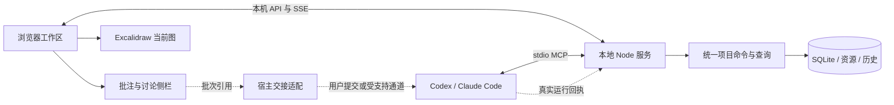

# Excalidraw 元可视化插件 V1 实施计划

日期：2026-10-03。计划版本：p1.3。新增独立调尺寸及收起的顶部/侧栏、保留中心的地图式缩放、正文滚动预览、手势归属与标题原位展开；实施和验收契约见[工作区交互修订](../WORKSPACE_CONTROLS_2026-10-03.md)。已完成的 p1.2 表达与 Harness 保留，D001–D017、M0–M6、跨平台及性能门槛继续分项验收。

本轮交互修订与实际演示见[交互审计](../INTERACTION_REVISION_2026-10-02.md)及[当前会话验收](../CURRENT_SESSION_DEMO_2026-10-02.md)。完整 V1 的未通过项仍按原门槛验收。

2026-10-02 元控件增量 p1.1：纳入 D013–D015，补齐对象摘要、有序分析分节、紧凑/卡片/全文呈现、可原位编辑的富文本框，以及同数据的文档阅读/自由排版视图。原标题节点演示未满足这部分需求。实施和验收门槛见[元控件修订](../SEMANTIC_CONTROLS_2026-10-02.md)；其他 M0–M6 和平台门槛保持。

固定需求入口：[需求审计](./excalidraw_plugin_requirements_audit.md)。术语入口：[Agent Visual Canvas 领域语言](../../CONTEXT.md)。架构记录：[项目状态与图上表示](../adr/0001-project-state-and-canvas-projection.md)。

## 1. 实施结论

建设一个独立的本地插件，暂称 Agent Visual Canvas：以 Excalidraw 作为交互画布，外层提供通用项目模型、子图导航、局部布局、批量反馈、讨论和历史。一个轻量 Node 服务通过 stdio MCP 接入 Codex / Claude Code，同时提供本机浏览器页面，复用现有模型会话。

V1 以单人本地协作为主，支持 macOS 和原生 Windows；跨机器通过完整项目包迁移。典型验收规模是项目几百个业务节点、每张子图几十个节点，规模不是产品硬上限。图内对话覆盖项目、图和对象相关的意见、Agent 答复及追问。

框架先提供任务、结构和流程的通用能力，以登记式扩展点容纳其他领域。当前 AutoResearch 是可选任务来源之一；插件作为独立子工程，不依赖其 Python 后端、研究执行流程或既有前端。

## 2. V1 范围与需求覆盖

| 范围 | 交付行为 | 需求依据 |
| --- | --- | --- |
| 实时任务展示 | Agent 结构化更新、状态及活动来源、父任务摘要、阻塞与最近变化 | D001、D003 |
| 通用图与子图 | 结构 / 流程 / 混合图，任意深度导航，跨图对象引用、面包屑和按需预览 | D003 |
| 自由编辑与局部布局 | 原生绘图、文本、图片、分组；固定位置、局部插入和排版预览 | D001、D003 |
| 批量独立批注 | 单选、多选、连线、区域，跨子图暂存，一次交接，逐条响应和追踪 | D006、D007 |
| 图相关讨论 | 项目 / 图 / 批注讨论侧栏，答复关联修改，追问保留目标与原始上下文 | D012 |
| 图上执行请求 | 继续、重试、停止请求；执行器能力检测、真实接收与生效回执 | D005 |
| 历史与恢复 | 有意义修改留痕、对象历史、版本比较、恢复形成新修订 | D002 |
| 本地部署 | stdio MCP、预构建页面、Codex 优先、Claude Code 通用工具兼容 | D008、D009 |
| 项目包迁移 | 图、资源、对象身份、批注、讨论和历史完整导出 / 导入 | D010 |
| 性能与交付 | 分层加载、按需预览、资源释放、双平台实机验收和可恢复升级 | D009、D011 |

首版交付核心画布、讨论和通用反馈交接；Codex 原生标注、Claude channels 及真实执行控制作为独立的宿主适配能力验收。未满足条件的能力清楚标示当前交接方式或不可用原因，核心反馈仍保存在本地。

## 3. 技术选型与工程位置

| 层次 | 敲定的实现方向 | 验证要求 |
| --- | --- | --- |
| 运行时 | Node 24 LTS 或更新的受支持版本；优先使用已有安装 | 当前本机 Node 26.8.1；Windows 及最低版本在 M0 核对 |
| 语言与契约 | TypeScript，版本化 JSON 契约，统一输入校验 | 有限坐标、稳定身份、版本和操作范围统一校验 |
| 前端 | React 19 + Vite，发布预构建文件 | Excalidraw 0.18.1 官方包支持 React 19；运行时直接加载发布资产 |
| 画布 | `@excalidraw/excalidraw` 0.18.1 | 固定发布版，使用公开 API；升级单独记录兼容性 |
| MCP | `@modelcontextprotocol/server` 2.2.0，stdio | 与实际 Codex / Claude Code 协商和工具调用验证；channels 另测 |
| 存储 | Node 内建 SQLite，事务、变更日志、快照及项目资源目录 | 当前本机已验证可用；M0 验证目标 Windows / 最低运行时 |
| 浏览器通信 | 同源本机 HTTP API + SSE 增量事件 | 重连携带游标；过期游标回到当前快照 |
| 布局 | 确定性局部插入；ELK.js 0.12.0 按需提供结构 / 流程布局候选 | 固定位置约束由外层检查，不依赖引擎自动保证 |
| 测试与构建 | TypeScript 检查、核心契约测试、真实浏览器验收、发布包启动检查 | 以关键不变量和实际协作为重点 |

版本依据为 2026-10-02 官方 npm 发布元数据；SDK 与布局库精确版本写入独立锁文件。M0 若发现目标客户端兼容问题，选择已发布的兼容版本，并记录理由和影响；不从开发分支引入未验证接口。ELK.js 采用其 EPL-2.0 许可路径，发布时携带对应许可和第三方声明。

工程根目录为 Loomgraph 仓库根目录，使用自己的依赖和构建配置。源码、检查结果与未通过项持续记录在阶段验收文件中；以下目录划分定义实施所有权。

```text
.
  CONTEXT.md
  docs/adr/
  src/contracts/         项目、操作、事件、反馈、执行器契约
  src/core/              命令校验、图关系、摘要、版本一致性
  src/store/             SQLite、资源、历史、快照与项目包
  src/server/            stdio MCP、本机 API、事件连接及生命周期
  src/canvas/            Excalidraw 场景映射、选择、变更和高亮
  src/ui/                总览、画布、子图导航、讨论与历史界面
  src/layout/            局部插入、布局候选及约束验证
  src/feedback/          独立批注、快照、上下文组装及逐条回执
  src/hosts/             通用交接、Codex 标注、Claude channels
  src/extensions/        对象类型、关系、视图与摘要的登记接口
  fixtures/              演示项目、回归项目、性能样例
  tests/                 核心、协议、持久化及浏览器验收
  dist/                  发布服务与预构建页面
```

## 4. 运行架构与生命周期



- 单个 MCP 连接的基础形态为一个 Node 进程；静态页面、API、事件连接和存储由它提供。浏览器复用已有进程，后台不启动额外模型或专用浏览器。
- V1 每个本机工作副本由一个写服务持有，多个浏览器标签页可以共享。第二个独立服务打开同一副本时返回已有服务入口及占用状态，写入明确拒绝；多来源任务可通过当前会话汇报。跨客户端切换释放旧连接或打开另一工作副本，避免额外常驻协调服务。
- 服务启动读取配置，校验存储格式，取得工作副本占用，再绑定 `127.0.0.1` 并返回页面入口。运行时入口描述单独保存，不进入项目包。
- stdout 仅输出 MCP 协议；日志输出到 stderr。stdio EOF / 客户端断开后完成已提交事务、停止接收新写入，关闭连接和存储并释放占用。浏览器显示已断开，未确认的修改保持待保存状态；重连按操作 ID 重试。
- 更新提交到存储后才发送 UI 事件。服务重启依照持久修订恢复；SSE 事件游标过期时重新读取快照，不能只靠临时事件重建状态。
- 本机写接口校验来源及运行时访问标识，服务入口和临时标识不进入反馈文本或项目包；核心不提供任意 shell 执行入口。
- 页面关闭释放画布、预览和布局任务。没有页面时，Agent 仍能更新数据；MCP 返回数据提交结果和页面连接情况，不宣称已经渲染。

## 5. 数据模型与一致性

| 记录 | 关键身份与字段 | 核心规则 |
| --- | --- | --- |
| Project / WorkingCopy | `projectId`、`workCopyId`、格式版本、当前修订 | 项目身份随迁移保留，工作副本身份区分两台机器继续产生的历史 |
| Entity / Task | `entityId`、类型、标题、状态、来源、时间、任务父项 | 业务对象身份不随标题或位置变化；任务包含采用明确父项 |
| Relation | `relationId`、类型、端点 | 包含、依赖、顺序、数据流和说明引用有明确区别 |
| Graph | `graphId`、类型、显示对象、子图入口 | 子图通过图引用和进入路径导航，多个入口可指向同一图 |
| Representation | `representationId`、`graphId`、`entityId`、元素绑定、布局和样式 | 一个业务对象可有多个表示；拖动只改变该表示的布局 |
| Free Element | `graphId`、`elementId`、原生元素内容 | 自由绘图完整持久化；绑定语义需要显式操作 |
| Annotation / Discussion | 独立 ID、原话、目标、观察修订、回应及追问 | 目标可包含业务对象、具体表示、自由元素、连线或区域 |
| FeedbackBatch / Context | 批次 ID、逐条清单、快照引用和交接状态 | 全部条目可追踪，完整上下文可按需读取 |
| Change / Revision | 全局唯一变更 ID、父变更、来源、原因、前后值 | 修订号用于本机连续阅读；副本分叉用工作副本及变更身份消除歧义 |
| Run / ControlRequest | 运行与请求 ID、任务、执行器、真实回执、能力范围 | 数据修改、请求接收与实际执行结果分别记录 |

任务父子结构不得成环；执行依赖按其声明的执行语义检查。可视化流程的回路与一般图引用允许表达，不能自动解释为可执行依赖。子图以独立场景导航，原生 Frame 仅用于图内组织。

同一任务在不同图上的状态共享，位置和样式独立。删除图上表示不删除任务；删除业务对象形成软删除及关联变更。复制业务图形默认建立同一对象的新表示，创建独立任务通过显式克隆操作；复制产生的表示和元素身份必须更新。

### 修改规则

1. Agent 与 UI 都提交类型化操作，携带项目 / 副本身份、基线修订、唯一操作 ID 及原因。
2. 存储事务校验影响对象，原子提交内容与变更日志，再返回新修订和影响范围。
3. 基线落后但受影响字段未变化时可合并；同一字段冲突则保留请求并返回具体冲突，不覆盖更新后的用户编辑。
4. 同一操作 ID、同一内容重试返回原结果；同 ID 改内容返回冲突。提交后连接丢失也按此规则恢复。
5. 一组有关联修改形成一个事务；一个反馈批次可以对应多个事务。界面渲染可以合并事件，历史不丢失有意义变更。
6. 坐标、样式、元素和资源引用都校验；未知扩展数据按版本保留，未知操作拒绝并说明原因。

状态默认使用待开始、进行中、阻塞、待确认、完成、失败、取消。父项优先显示唯一有效叶子任务的“完成 n/m”、阻塞 / 失败数和最近活动；取消单列，不作为完成。父项执行状态和子任务汇总并列，避免一个失败被百分比掩盖。

Agent 报告和执行器观测均保留来源。图上完成表示工作状态；独立验证结果另作标记。导入或连接过期后，正在运行状态显示其报告时间和待核实提示。

## 6. 界面与主要操作

默认打开项目总览：顶部显示当前项目、子图路径和连接状态；中央只有一个当前 Excalidraw 场景；侧栏按需显示对象详情、讨论或历史。总览突出进行中、阻塞、失败、待回应和最近变化，状态以文字、符号和颜色共同表达。

| 场景 | 操作 | 反馈 |
| --- | --- | --- |
| 查看进度 | 打开总览或点击异常摘要 | 展示来源和更新时间，定位相关任务 |
| 查看细节 | 点击子图入口 | 进入子图，保存原视口；面包屑 / 返回恢复进入路径 |
| 快速预览 | 悬停子图入口或点击预览按钮 | 显示缓存缩略图、版本和摘要，过期预览按需更新 |
| 标注对象 | 单选、多选或选择连线，再点“反馈” | 轻量输入框自动附带目标，保存后出现编号 |
| 标注区域 | 框出区域，再点“反馈” | 保存区域、候选对象和观察版本，可用于空白或布局意见 |
| 批量交接 | 跨图连续暂存，检查列表，再点交接入口 | 一个批次，多条独立批注；显示实际交接阶段 |
| 查看回应 | 点击编号或讨论列表项 | 看到对应答复、修改摘要和版本，可定位或追问 |
| 排版 | 选中范围，点“整理” | 比较布局候选，应用后形成变更；保留固定位置 |
| 执行控制 | 选中有运行记录的任务 | 按执行器能力展示继续、重试、停止请求及回执 |
| 跨机接续 | 导出项目包，在另一台机器导入 | 恢复图、讨论和历史，显示来源及待核实运行状态 |

总览、当前图、异常聚焦、最近变化、子图缩略图和 SVG / PNG 导出预览共用项目数据。搜索按标题与身份定位，避免要求用户在大图中反复找节点。列表筛选不改动原图数据。

普通更新不改变用户视口；Agent 指示默认使用临时高亮和提示。跨图目标显示可点击入口，“跟随 Agent”启用后才自动导航。高亮使用外层覆盖图层，按时清除，不写入项目内容或历史。

用户修改受管节点文字时，通过明确的元素绑定更新业务字段；拖动、尺寸和样式属于该图上表示。自由文字和图形按原生内容保存。人工移动默认保护该位置，用户可解除固定；固定位置仍允许更新状态和内容。

## 7. 局部布局与自洽边界

V1 支持三类布局行为：

1. **增量插入**：新增节点放在父项、依赖邻近或可用空白处，使用确定性间距和碰撞检查，保留已有固定位置。
2. **局部整理**：选定一组可移动表示，结构图使用层次 / 树形候选，流程图使用分层候选，混合图按明确关系和主布局方向处理。
3. **整图候选**：用户显式请求时生成全图预览，标明固定约束和受影响表示，再应用为一个变更。

布局输入包含元素尺寸、当前位置、固定区域、明确关系、布局方向及来源修订。ELK 只产生候选，外层验证固定位置未变、内容边界和碰撞；不能把引擎输出直接当作满足全部约束的结果。约束无法同时满足时返回具体问题及可检查候选，保留原布局。

状态更新只改状态与摘要。长标题采用明确换行和详情展开，完整内容仍可读取；字体加载及尺寸变化触发局部校验。人工连线路径和业务关系端点分别保留，自动路由影响范围进入布局预览。

布局在请求或结构增量时运行，使用有界计算和按需 worker；页面关闭取消未应用候选。浏览器未打开时可用已保存的尺寸生成候选，标记尺寸来源；需要真实文字度量的候选在页面可用后校验，不静默应用未经验证的大范围排版。

V1 的“自洽”指稳定身份、多视图状态一致、固定位置可保护、新增与选定范围可以整理、排版变化有版本可回看。任意复杂自由绘图、所有关系共同最优及持续全局约束求解属于后续能力，不能作为本版承诺。

## 8. 批量批注与图相关讨论

### 8.1 数据与交互

每条批注有独立身份和原始用户文本，目标支持对象、具体图上表示、自由元素、连线及区域。未绑定对象的整体意见可关联项目或当前图。用户连续暂存时不立即通知 Agent；切换子图保留列表。

草稿自动持久化并合并输入记录，暂存 / 提交形成有意义的批注修订。用户查看修改、取消勾选或删除草稿都保持条目边界。发送失败仍能找回原话和目标。

讨论侧栏显示该项目、图或批注的用户意见、Agent 回应和后续追问；每条答复关联批注、变更及执行回执。回复原问题时保留原目标，追加追问自动带上已有讨论摘要和当前状态变化。侧栏只记录图相关讨论，不读取完整宿主聊天。

可见状态保持精简：待发送、待处理、已响应、需澄清及失败提示；交接详情区分本地保存、待宿主发送、通道已通知、Agent 已接收和实际处理结果。“已响应”不等于用户已经认定问题解决，允许继续追问或重新打开。

### 8.2 上下文组装

批次冻结后形成快照引用；用户原话保持完整，每条保留自己的观察版本。提交时读取一致的当前快照，附带相关变化，结构化上下文和可选图像必须来自同一版本。

上下文按以下顺序组织：

- 批次清单：项目 / 副本、目标、所有条目 ID、所在图和处理状态；长批次分页但清单完整。
- 共享背景：项目目标、必要图关系、修改规则及人工固定约束。
- 去重对象表：身份、标题、类型、状态、直接关系、必要位置与尺寸。
- 每条意见：原话、目标引用、观察版本、相关变化及需要的局部预览引用。
- 回写要求：逐条答复、影响对象、变更 ID、结果版本、失败或澄清原因。

默认读取目标和必要的直接邻接信息，跨图补父入口摘要；更深子图和完整原始元素按需读取。区域候选对象是辅助背景，Agent 按实际意图选择修改范围。反馈中的图像辅助排版和视觉判断，稳定身份用于执行。

例如一批分别要求改名、调整间距和解释依赖的意见，三个条目各自关联对象与原话；共享对象只展开一次。改名与解释可分别处理，间距要求出现约束冲突时单独请求澄清，不让其余条目丢失或被误标完成。

### 8.3 处理与重试

Agent 先读取清单和所需上下文，识别目标重叠、前置依赖及语义冲突，再按独立项或有关联组实施。系统负责身份、版本和重叠检查；语义冲突仍需结合原话判断。

读取 / claim、答复和修改均携带批次与条目 ID。每条允许关联多个变更，多个条目可以关联同一变更；需要澄清只阻止该条及依赖它的条目。分段处理保留游标和全部条目状态，不能因上下文预算省略余项。

重试以批次、条目及操作身份去重。连接失效后可恢复处理游标，但已生效的外部执行请求不能自动重发；先核对原请求回执。用户发送新追问形成新条目 / 讨论消息，沿用相关引用。

## 9. MCP 工具与 Agent 使用约定

初始工具控制在九个有明确职责的入口，复杂行为通过版本化参数表达；实现时避免把整个项目 JSON 和重复截图塞进每次返回。

| 工具 | 职责 | 主要返回 |
| --- | --- | --- |
| `canvas_open` | 创建或打开项目 / 工作副本 | 页面入口、身份、修订、连接和能力 |
| `canvas_read` | 按图、对象或运行读取当前 / 指定版本信息 | 有界数据、引用和分页游标 |
| `canvas_apply` | 原子提交业务、图形、布局等类型化增量 | 操作 ID、变更、修订及具体冲突 |
| `canvas_feedback` | 列表、上下文读取、接收及逐条响应 | 批次清单、快照引用、条目状态 |
| `canvas_present` | 临时高亮、定位请求和布局预览 | 显示 / 待查看结果、布局候选及版本 |
| `canvas_history` | 读取最近变化、对象历史和版本差异 | 摘要、变更引用和有界比较 |
| `canvas_restore` | 按指定历史形成新的恢复变更 | 冲突检查、影响范围及新修订 |
| `canvas_package` | 一致快照导出和独立副本导入 | 文件 / 项目身份、校验和来源版本 |
| `canvas_execution` | 能力登记、执行请求读取、运行及回执报告 | 请求 ID、运行身份、接收和生效状态 |

所有写入工具使用明确身份、基线、幂等操作 ID 和影响范围。工具返回结构化内容，错误使用具体类型，例如 `VERSION_CONFLICT`、`PROJECT_IN_USE`、`TARGET_REMOVED`、`CAPABILITY_UNAVAILABLE`；不把失败伪装成空数据。

工具只读与写入的标注按实际能力设置；包含写行为的组合入口不能整体标为只读。工具名和参数版本冻结后，通过兼容扩展演进；破坏语义的变更另立契约版本。

插件提供紧凑 Agent 使用说明：先读目标上下文，保留稳定身份和人工布局；结构化上报状态及来源；批注逐条回应；实际修改用受版本保护的操作；停止等请求按真实执行器处理。该说明可做客户端可用的 skill，核心运行不依赖某一种技能格式。

## 10. 宿主适配与执行控制

### Codex

- 先验证实际桌面版本、账号与页面上的 API。顶层本地页面注册 canvas surface，以可见对象几何、稳定 ID、版本和轻量高亮响应选择。
- 原生附件元数据只携带短引用，例如项目、副本、批次、修订和上下文引用；完整文本与图关系由 MCP 读取。
- 批次上下文提前保存并准备有效引用；用户点击交接入口时同步请求原生编辑器，不能先 await 网络而丢失用户操作资格。程序请求目标使用可见的批次摘要 DOM，单个画布对象选择使用 surface。
- 原生编辑器 accepted 只代表请求被接受。只有用户实际提交并由 Agent 读取该批次后，才可确认接收；取消编辑器不会丢失本地批注。
- API 不可用时，提供一段含批次引用的简短交接文本，由用户送入现有对话，Agent 按相同工具读取。页面不启动新 Codex 模型会话。

### Claude Code

- 通用 stdio 工具与独立浏览器页面为基础兼容路径。
- channels 为条件能力；验证认证、组织设置、客户端版本、开发 channel 加载方式及自定义通知与 SDK 的兼容性后，才启用主动通知。
- 通知仅携带批次引用和简短说明；事件排队和 Agent 接收分别记录。条件不满足时使用同一简短文本交接路径。

### 执行请求

任务关联运行后，执行器登记支持的请求类型、作用范围和当前连接。一次请求指定任务、运行和执行器，多个活动运行时要求明确选择目标。

请求状态包含待交接、已接收、已生效、拒绝、失败和需要核实。继续 / 重试产生或关联明确运行；停止以执行器实际终止结果回写。取消图上记录不终止进程，历史恢复也不重启运行。

回合级中断与任务级停止分别展示。只有宿主确认可附着既有会话并暴露该动作时，才能调用相应控制适配；普通 MCP 请求取消不作为整轮停止。能力缺失时保留请求与原因，不显示已停止。

执行请求的队列、交接和逐项真实回执属于 V1 必交付；立即中断任意宿主会话不属于通用保证。每个发行配置明确列出实际支持的动作和剩余限制，不能把 mock 执行器验收当成真实宿主控制通过。

## 11. 历史、撤销与项目包

### 历史和撤销

- SQLite 事务保存当前记录、前后值及变更身份；关联拖动 / 输入合并为一次用户修改，临时视口和高亮不生成内容修订。
- 初始快照策略为每 100 个逻辑变更或累计 4 MiB 增量形成检查点，并在迁移 / 里程碑时按需生成；这些是实施参数，可依据基准调整并记录。
- 默认保留内容历史，按需分页加载；V1 不自动清理仍被批注和历史引用的数据。体积达到配置预算时提示，由明确历史保留策略处理。
- 使用项目变更作为内容撤销依据；当前图的撤销撤回最近适用的人工变更，检查被修改字段的后续变化，保护 Agent 新增的状态更新。文本输入中的原生文字撤销保留。
- 项目历史恢复和跨图批次恢复提供影响摘要，形成新修订；恢复无法撤销已经发生的外部执行。实现不依赖 Excalidraw 私有历史对象，公开 API 与键盘 / 工具栏的实际行为在 M0 验证。

### 项目存储

默认项目内容位于用户选择的项目目录内：

```text
.agent-canvas/
  manifest.json            格式、项目和工作副本身份
  project.sqlite           当前内容、批注、讨论、修订和快照
  assets/                  已登记的图片等资源
  cache/previews/          可重建的按版本预览
```

运行时连接描述、占用信息和会话绑定放在本机运行时目录；缓存和运行时文件不作为项目包的完整性前提。项目数据默认作为本地运行数据管理，代码版本与内容版本分别留痕。

### 导出 / 导入

导出生成有格式版本的 `.avcanvas` 项目包，内容为清单、SQLite 一致快照和已登记资源。资源以相对路径 / 内容身份引用，并带校验；用户引用的外部代码库和大型资料只保存来源引用，不自动收入整个目录。

导入先在临时目录校验格式、资源、引用和完整性，再创建独立工作副本。已有同一项目时展示来源版本并创建另一副本，原项目不被覆盖；格式升级先备份旧内容，失败保留原文件。

业务与图形身份、批注目标、原始讨论和历史来源保持不变，新变更带新工作副本身份。待发送批注可以继续使用，历史发送和执行请求不自动重发；旧运行状态等待新执行器核实。宿主连接在目标机器重新建立。

## 12. 扩展契约

V1 提供编译时登记的扩展接口，并用一个普通“模块 / 任务”扩展样例证明其可用：

- 对象和关系类型：版本、字段校验、显示名称、状态摘要和可用关联。
- 视图类型：对象过滤 / 投影、图内表示、子图入口和预览摘要。
- 布局配置：主方向、间距、分组和固定约束输入。
- 上下文提供者：按反馈意图补充有界的领域信息，保留来源。
- 执行器适配：能力、请求交接、运行来源和真实回执。

通用存储、版本、批注及导航协议由核心负责。扩展可以增加类型和摘要，业务关系必须显式声明。缺少扩展时仍能保留和查看已有图形及原始数据，避免导入时丢弃未知类型。

发布版加载随包登记的代码和数据 schema；任意画布 JSON 不会变成可执行扩展。在线插件市场、热加载用户脚本、多进程扩展沙箱及完整设计系统排版留在后续版本。

借鉴 promo-workflow 的版本绑定反馈、对象指认和逐项回执思路；核心 schema、导航和排版保持领域通用。

## 13. 分阶段实施与通过条件

实施按 M0 → M1 → M2 → M3 → M4 → M5 → M6 推进。每阶段保留实际结果及剩余限制；阶段通过再扩大范围，出现问题优先修正所属层。

| 阶段 | 工作及交付物 | 通过条件 |
| --- | --- | --- |
| M0：关键接口验证 | 独立工程最小验证；发布版场景更新、选择、临时高亮、业务文字编辑、受保护撤销；Node / SQLite / MCP 兼容；宿主能力表 | 能在公开 SDK 上实现局部更新，保护位置与视口；撤销不会覆盖新状态；能启动 stdio、读写数据库；宿主支持 / 缺失项目均有实际证据 |
| M1：项目内核与数据链路 | 契约、持久化、版本和幂等；最小 MCP 工具；本机页面与事件重连；对象 / 表示映射 | 一个 Agent 工具更新可持久化并显示；重启可恢复；重复操作不重复提交；旧版本同字段冲突可准确返回 |
| M2：图与交互 | 总览、结构 / 流程 / 混合图、子图导航、摘要、搜索、预览、固定位置和局部布局 | 同对象跨图状态一致；图间往返恢复视口；状态更新不重排；约束失效时原布局保留；自由绘图不丢失 |
| M3：反馈与讨论 | 连续独立批注、跨图批次、快照与上下文、讨论追问、逐条结果和处理恢复 | 一批多条意见可完整读取和逐条回写；一条需澄清不阻断无依赖项；移动 / 删除 / 旧版本情况下仍指向正确目标 |
| M4：宿主与执行适配 | Codex 本地工具和原生标注适配；Claude 工具与条件 channels；通用交接；执行能力和回执 | 各宿主可完成批次读取 → 修改 / 回答 → 图上关联；取消或失败保留批注；控制请求按实际能力交接并核实结果；能力表如实填写 |
| M5：历史与迁移 | 最近变化、对比、撤销 / 恢复；一致快照项目包；格式迁移和备份；独立副本导入 | Mac → Windows → Mac 保留完整内容与身份；恢复产生新变更；损坏包不影响已有项目；导入不启动或重发旧执行 |
| M6：完整验收与发布 | 基准负载、关键场景回归、双平台发布包、Codex 插件包装 / Claude 配置、使用说明与恢复说明 | 核心必需项和负载预算通过；依赖及本地资源齐全；从发布包启动而非开发环境；客户端适配限制有可见说明 |

M0 的 Excalidraw / 数据一致性问题属于继续实现的技术前置；宿主专用 API 缺失则启用已规划的通用交接，不把核心工程重做为另一套聊天客户端。Windows 实机不可达时仍可继续其他工作，但 Windows 验收保持待验证，发布报告不能宣称双平台已经通过。

完整 V1 核心完成要求 M1–M6 的核心项全部通过。专用宿主能力逐项列状态；未支持的即时中断、channels 或原生标注不能被宣称完成。执行请求交接、持久记录和准确回执机制仍必须交付。

### 需求到阶段追踪

| 需求 | 主要阶段 |
| --- | --- |
| D001 增量维护 | M1、M2 |
| D002 变更与历史 | M1、M5 |
| D003 子图、预览与局部布局 | M0、M2 |
| D004 文本留痕 | 全阶段的审计与证据记录 |
| D005 执行请求 | M4 |
| D006 / D007 简便标注及批量上下文 | M3、M4 |
| D008 / D009 双平台 stdio 与低负载 | M0、M4、M6 |
| D010 项目包接续 | M5 |
| D011 典型规模 | M2、M3、M6 |
| D012 图相关讨论 | M3、M4 |

## 14. 固定验收样例与初始性能预算

### 固定项目

使用固定种子生成一个项目：500 个业务对象（任务与结构对象混合），20 张图，每张约 50 个图上表示，包含同对象跨图引用、至少五层导航路径及混合关系。当前图有约 60 条连线、10 个固定位置、自由文字 / 形状及少量图片。

保留 10,000 条有意义历史变更和一个跨三张图的 30 条独立批注批次。测试素材总量限定在 10 MiB 内，另设置资源较大的压力样例；分别报告业务对象、图上表示、原始元素、边和资源数量。

覆盖持续每秒五次状态更新，以及一次 100 项更新的合并提交。夹杂节点新增、布局意见、用户移动、目标删除、断连重试和跨版本批注；大幅状态变化仍不抢视口。

### 初始预算

以下为实施验收目标；实际测量及证据边界持续记录在阶段验收文件和性能报告中。预算如需调整，记录测试环境、原因和变更，不能静默放宽。

| 指标 | 初始目标 | 测量口径 |
| --- | --- | --- |
| 后台服务空闲 CPU | 60 秒均值不超过一个逻辑核心的 1% | 无页面交互、无任务更新；CPU 时间 / 墙钟时间 |
| 后台服务内存 | 固定项目下 RSS 不超过 150 MiB | 记录冷启动、热态、批注 / 导出期间峰值；峰值单列 |
| 可见画布空闲 CPU | 稳态单逻辑核心均值不超过 1% | 字体和首图加载完成，无持续动画与布局 |
| 画布浏览器内存 | 相对同浏览器空白页增量目标不超过 300 MiB | 记录页面相关进程及口径；与后台服务分开 |
| 状态更新 | 提交成功到可见更新 p95 不超过 300 ms | 固定的持续 / 合并更新样例，时间跨层记录 |
| 首次打开 | 本地固定项目主要内容可交互不超过 3 秒 | 从浏览器导航计时；冷 / 热资产缓存分别报告 |
| 热态子图切换 | p95 不超过 500 ms | 返回视口恢复，不等待所有子图预览 |
| 批注上下文 | 30 条结构化上下文准备 p95 不超过 1 秒 | 图像生成另测，不能用省略条目换取速度 |
| 未缓存局部预览 | 典型子图目标不超过 2 秒 | 已打开页面，资源已加载；缓存命中另记 |
| 退出与释放 | 正常 stdio 结束后三秒内退出服务 | 已提交内容可恢复，连接 / 占用 / worker 已释放 |

拖动和缩放记录帧间隔、长任务及主观操作卡顿；初始目标为当前图操作 p95 帧间隔不超过 33 ms，并排查持续超过 100 ms 的交互阻塞。基准记录硬件、OS、客户端、运行时、浏览器、SDK 版本及缓存状态，不能横向混用测试数字。

至少执行三轮固定基准；页面开关和子图往返覆盖十次循环，检查事件订阅、预览与 worker 是否持续增加。性能报告记录原始样例和结果，不用单次最好值替代稳定表现。

## 15. 必须通过的正确性场景

1. 同一任务的多图表示同时更新，取消项与重复表示不重复计入父项完成数。
2. Agent 更新时用户视口、固定位置和未发送批注保持；开启跟随后才按约定定位。
3. 任务拆分、关系修改、文字编辑、复制 / 删除表示和业务对象分别遵循身份规则。
4. UI 与 Agent 修改交错，旧基线无关字段可合并，同字段返回冲突；撤销保护后续修改。
5. 服务在提交后返回前断开，使用相同操作身份重试不重复提交；未提交内容能重试。
6. 连续标注跨图及不同观察版本，原话、目标、预览和相关变化一致；已删除对象使用历史引用。
7. 30 条批注全部留在清单，分页 / 分段不漏项；依赖、冲突与澄清结果逐条回写。
8. 图相关追问能定位原对象与修改，并保留之前的讨论来源；迁移后仍可查看。
9. 子图多入口、深层返回和图引用回路导航可恢复路径，不当作原生嵌套 Frame。
10. 临时高亮在缩放、平移和对象移动后正确；不会进入内容历史或遮断正常操作。
11. Codex 原生选择的身份和版本正确；批次程序请求使用可见 DOM；取消、API 缺失或被拒绝不误报送达。
12. Claude 条件通知和通用文本交接都能读取同一个批次；忙碌排队不误报即时处理。
13. 控制请求带明确运行范围；回合中断、任务停止、消息接收和记录取消分别核对。
14. 项目包双向迁移保留身份和历史；格式不兼容、资源缺失、校验失败在正式导入前被检测。
15. 导入 / 历史恢复不触发外部执行，状态保留来源并等待核实；两个副本的后续修订可区分。
16. 中文 / 英文、长标题、图片和字体资源在离线本地页面可显示；导出预览与所选快照一致。
17. 发布包从含空格 / 中文的路径及 Windows 路径启动，stdout 可被纯 MCP 客户端解析，正常关闭和重启可恢复。
18. 同副本第二个写服务不会形成第二个状态权威；占用提示、正常释放和崩溃恢复均可解释。

核心契约与历史规则用自动测试验证；选择、标注、视口、撤销及宿主交接用真实浏览器 / 客户端验证。构建通过、工具列表可见、mock 回执及实际产品操作分别记录。

## 16. 发布、安装与维护

发布包包含打包后的服务、预构建前端、Excalidraw 必需本地资源与可分发字体、第三方许可、示例项目、客户端安装片段、Agent 使用说明、故障与恢复说明。日常运行不启动 Vite watcher，不反复下载依赖；大型预览和布局按需计算。

Codex 提供与实际版本兼容的插件包装及 stdio 配置；Claude Code 提供同一服务入口的 MCP 配置，channels 加载方式单独说明。配置直接调用 Node 并使用参数数组，按机器填写路径；安装更新仅处理本插件配置和文件，保留旧配置和上一发布包以便恢复。

M0 核对实际宿主支持的插件清单格式；可用包装和通用 MCP 安装途径均有独立 smoke 记录。软件发布版本、数据格式版本、扩展契约版本和项目内容修订分别管理。

代码按阶段形成范围明确的提交和变更记录；当前仓库其他未提交工作不纳入插件提交。数据升级先备份，测试旧包读入与新包重开；后续破坏性格式变化明确发布迁移工具。

每阶段验证记录至少包括：阶段、版本、目标环境、输入样例、实际结果、证据引用、未通过项与下一步。发布能力表分别覆盖 macOS Codex、Windows Codex、Claude 通用工具、原生标注、channels 和执行动作。

## 17. 风险处理与后续范围

| 需要验证的边界 | 处理方式 | 验证阶段 |
| --- | --- | --- |
| SDK 更新、选择和撤销的实际组合行为 | 小样例先验证公开 API；必要时修正映射和宿主撤销，不依赖私有实现 | M0、M2 |
| 任意固定位置下的复杂布局 | 候选加约束检查；保留原图，报告不能满足的部分 | M2 |
| 不同宿主版本 / 账号的主动交接 | 能力检测及通用文本交接；按实际适配状态说明 | M0、M4 |
| stdio 无法直接中断既有宿主会话 | 执行请求和能力范围分开；当前无接口的动作明确不可用 | M4 |
| 空闲负载、字体和图像开销 | 本地资产、按需加载与预览；分项测量和有界缓存 | M0、M6 |
| Node SQLite / 发布包跨平台兼容 | 最低运行时与目标 Windows 实测；如需变更绑定，形成明确技术修订 | M0、M5、M6 |
| 历史增长与跨机分叉 | 分页、检查点、独立副本身份；不自动合并分叉历史 | M1、M5 |

后续范围包括：多客户端同时写同一副本的协调、跨设备自动同步、多人实时协作、完整聊天客户端、更丰富领域扩展、同屏千级大图优化、在线扩展安装、复杂版面约束及更深宿主执行适配。它们通过新的需求和计划修订引入，不占用 V1 基础闭环的交付顺序。

## 18. 依据、证据边界与计划修订

本计划采用当前已确认需求和 2026-10-02 的官方接口核对，完整来源见需求审计。新增技术核对包括：

- Excalidraw 0.18.1 发布元数据及 React 兼容范围：https://registry.npmjs.org/@excalidraw/excalidraw/0.18.1
- MCP server 2.2.0 发布元数据：https://registry.npmjs.org/@modelcontextprotocol/server/2.2.0
- ELK.js 0.12.0 发布元数据：https://registry.npmjs.org/elkjs/0.12.0
- Node SQLite 官方说明：https://nodejs.org/api/sqlite.html
- 本机只读运行时检查：Node 26.8.1；内建 SQLite 可创建内存数据库，返回 SQLite 3.53.4。

官方接口、发布元数据和本机运行时检查支持技术选型。本文中的通过条件是实施基线，不能作为已通过证据；当前插件功能、宿主接入、执行控制及性能的实际结果与未通过项，统一以阶段验收记录为准。

| 计划修订 | 日期 | 变化 |
| --- | --- | --- |
| p1.0 | 2026-10-02 | 汇总 D001–D012，敲定独立本地插件、通用模型、交互、上下文、适配、历史与迁移；制定 M0–M6、固定样例、性能预算和发布条件 |

实施从 M0 关键接口验证开始，依序推进数据链路和完整交互。已授权实施不重复启动需求审计；后续范围变化另行修订，技术修复和验收结果进入阶段记录。

| p1.3 | 2026-10-03 | 栏位尺寸/显示偏好、地图缩放、手势保持、正文预览与原位细则；实际通过证据见工作区交互专项验收 |
